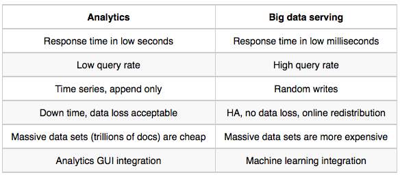

---
# Copyright 2018 Yahoo Holdings. Licensed under the terms of the Apache 2.0 license. See LICENSE in the project root.
title: "Migrating from Elastic Search to Vespa"
---


In this document we will take a look at the main differences between Elastic Search and Vespa, explain some of the basic concepts of Vepsa, and show you step by step how to move your data from Elastic Search to Vespa in addition to generating a deployable Vepsa application package.


#### List of contents

* [Overview of Vespa](#Overview_of_Vespa)
* [Why migrate to Vespa](#Why_migrate_to_Vespa)
	* [Analytics vs. Big Data Serving](#Analytics_vs_Big_Data_Serving)
	* [Use cases](#use_cases)
* [Important differences from ES to Vespa](#Important_differences_from_ES_to_Vespa)
	* [Basic consepts](#Important_differences_from_ES_to_Vespa)
		* [Queries](#queries)
		* [YQL](#yql)
		* [Real Time](#real_time)
		* [The node concept](#the_node_concept)
		* [Documents](#documents)
		* [Application Package](#application_package)
* [Step by step: Migrate from Elastic Search to Vespa](#Migrate)
	1. [Moving documents from ES to Vespa](#Moving_documents_from_ES_to_Vespa)
	2. [Parsing the documents and generating an application package](#parsing)
	3. [Deploying Vespa](#deploy)
	3. [Feeding](#feeding_vespa)
	4. [Querying](#querying)
* [Feeding](#feeding)
* [How to scale / Get a hosted service](#how_to_scale)
* [Tutorials](#tutorials)
* [Help](#help)


<a id="Overview_of_Vespa"></a>
## Overview of Vespa

Vespa is a platform that allows you to develop and run scalable, low latency, stateful and stateless backend services easily. [This document](https://docs.vespa.ai/documentation/overview.html) provides an overview of the features and main components of the platform.

<a id="Why_migrate_to_Vespa"></a>
## Why migrate to Vespa

For who will Vespa serve better? 

<a id="Analytics_vs_Big_Data_Serving"></a>
#### Analytics vs. Big Data Serving

<div style="text-align:left"></div>


<a id="use_cases"></a>
#### The different use cases

<div style="text-align:left"></div>


With focus on big data serving, Vespa is optimized for **low millisec response**, **high write and query load**, **Machine Learning integration** and **automated high availability operations**. Vespa support true realtime writes, and true partial updates, and is also easy to operate at large scale. Here can you read about Vespa's [features](https://docs.vespa.ai/documentation/features.html).


Vespa is the only open source platform optimized for such big data serving.


<a id="Important_differences_from_ES_to_Vespa"></a>
## Important differences from ES to Vespa

<a id="queries"></a>
#### Queries

Like Elastic Search, Vespa supports both queries with POST- and with GET-requests.

The general form of search requests with JSON-queries is:

```
{
  param1 : value1,
  param2 : value2,
  ...
}
```

The general form of a search GET-request is:

```
http://host:port/search/?param1=value1&param2=value2&...
```

* Note that the GET-query must be URL-quoted.

As for an example of the format:

```
{
    "yql" : "select * from sources * where default contains \"bad\";",
    "offset" : 5,
    "ranking" : {
        "matchPhase" : {
            "ascending" : true,
            "maxHits" : 15
        },
    },
    "presentation" : {
        "bolding" : false,
        "format" : "json"
    },
    "nocache" : true
}
```

With Vespa running (see [Quick Start](https://docs.vespa.ai/documentation/vespa-quick-start.html) or [Blog Search](https://docs.vespa.ai/documentation/tutorials/blog-search.html)) you can visit the GUI for building queries at [http://localhost:8080/querybuilder/](http://localhost:8080/querybuilder/), where you can try writing a few queries.

Please take a further look at the [Search API](https://docs.vespa.ai/documentation/search-api.html). All the possible parameters are listed in the [Vespa Search API reference](https://docs.vespa.ai/documentation/reference/search-api-reference.html)

<a id="yql"></a>
##### YQL - Yahoo! Query Language

Vespa search queries are not database queries. The basic assumption is ideally a single document should be returned, and that should be an optimal answer to the query. Therefore a query with e.g. no terms does not return all documents, it is an error.

###### YQL 101
An example of yql: `select * from sources * where text contains "blues";`.
This is a search for all documents where the field named text contains the word blues. 

See [here](https://docs.vespa.ai/documentation/query-language.html) for more information about the YQL operators and more examples. 


<a id="real_time"></a>
#### Real Time
Vespa is an engine for executing and serving computations over large data sets in real time. It allows you to write and persist any amount of data, and execute high volumes of queries over the data which typically complete in **tens of milliseconds**. This real time serving gives UI friendly response times and instant writes at high volume.


<a id="the_node_concept"></a>
#### The node concept
A node in this context is the environment where some Vespa services are running. This can be an actual machine like a server in a datacenter, or a laptop for developement and testing of Vespa configuration. It can also be a Virtual Machine or a Docker container, so you can run multiple nodes on a single piece of hardware.

The different Vespa services that run on nodes will mostly communicate with each other via the network. This means that all nodes must have an IP address and have network connectivity to all other nodes. Both IPv4 and IPv6 protocols are supported. Note that the same framework is used even when running the entire Vespa stack on a single node.


<a id="documents"></a>
#### Documents

Vespa models data as *documents*. A document have a string identifier, set by the application, unique across all documents. A document is a set of key-value pairs. A document has a schema (i.e. type), defined in the [search definition](https://docs.vespa.ai/documentation/search-definitions.html). Which e.g. can look like this:

```
search music {
    document music {
        field artist type string {
            indexing: summary | index
        }

        field song type string {
            indexing: summary | attribute
        }
    }
}
```

When configuring clusters (in [services.xml](https://docs.vespa.ai/documentation/reference/services.html)), a `<documents>`-element set what document types a cluster is to store.


<a id="application_package"></a>
#### Application Package

A Vespa application package is the set of configuration files and Java plugins that together define the behavior of a Vespa system: what functionality to use, the available document types, how ranking will be done and how data will be processed during feeding and indexing. The search definition, e.g., `music.sd` just above, is a required part of an application package — the other required files are `services.xml` and `hosts.xml`

The application package consists of one directory named the same as the application, containing at minimum:

```
application/services.xml - mandatory specification of services required
application/hosts.xml - mapping of host ids to physical hosts
```

Additionally, services.xml might consume other files or directories from the application package - a quick summary of optional content:

```
application/components/ - OSGi components to be deployed to container nodes. See component types
application/searchdefinitions/ - Vespa document schemas, and optionally how to search them
application/search/query-profiles/ - Vespa query profiles; named collections of search request parameters
```

Read more [here](https://docs.vespa.ai/documentation/cloudconfig/application-packages.html)

We will generate a deployable application package [here](#Moving_documents_from_ES_to_Vespa) from your existing Elastic Search cluster.


<a id="Migrate"></a>

## Step by step: Migrate from Elastic Search to Vespa

It is possible to use [ElasticDump](https://github.com/taskrabbit/elasticsearch-dump) to get all documents from Elastic Search in a JSON-file. Assuming starting in a empty folder.


<a id="Moving_documents_from_ES_to_Vespa"></a>
#### 1. **Get all documents from Elastic Search with ElasticDump**

 ```
$ git clone --depth 1 https://github.com/taskrabbit/elasticsearch-dump.git
 ```


 Then get all documents and mapping from your cluster(s) with:

 ```bash
$ `pwd`/elasticsearch-dump/bin/elasticdump \
  --input=http://localhost:9200/my_index \
  --output=/path/to/empty/folder/my_index.json \
  --type=data


 $ `pwd`/elasticsearch-dump/bin/elasticdump \
  --input=http://localhost:9200/my_index \
  --output=/path/to/empty/folder/my_index_mapping.json \
  --type=mapping
 ``` 
 
 * `--input` should be the url to your Elastic Search index
 * `--output` should be the path to your intially empty folder


<a id="parsing"></a>
#### 2. **Parse the ES-documents to Vespa-documents and generate an Application Package**

 Download ES_Vespa_parser.py [here](https://github.com/vespa-engine/vespa/tree/master/config-model/src/main/python), and place it in your intitially empty directory.
 
 **Usage:**
 
 ```
$ ES_Vespa_parser.py [-h] [--application_name APPLICATION_NAME] documents_path mappings_path
 ```
 
Run this command in your folder to parse the documents, so that it can be feeded to Vespa:

 ```
$ python ES_Vespa_parser.py my_index.json my_index_mapping.json
 ```

* `--application_name` defaults to "application_name" - just change if you want
	* The document ids will become *id:`application_name`:`doc_name`::`elasticsearch_id`*


The directory has now a folder `application`:


 ```
/application
      │     
      ├── documents.json
      ├── hosts.xml
      ├── services.xml
      └── /searchdefinitions
            ├── sd1.sd
            └── ... 
 ``` 
 Which contains your converted documents, their search definitions, a hosts.xml and a services.xml - a whole application package.


<a id="deploy"></a>
#### 3. **Deploying Vespa:**

 Go into your initially empty folder. This tutorial have been tested with a Docker container with 10GB RAM.
 We will map the this directory into the /app directory inside the Docker container. Now, to start the Vespa container:
 
 ```bash
 $ docker run -m 10G --detach --name vespa --hostname vespa-es-tutorial \
    --privileged --volume `pwd`:/app \
    --publish 8080:8080 --publish 19112:19112 vespaengine/vespa
 ```
 
 Make sure that the configuration server is running:
 
 ```bash
 $ docker exec vespa bash -c 'curl -s --head http://localhost:19071/ApplicationStatus'
 ```
 
 **Deploy the `application` package:**
 
 ```bash
$ docker exec vespa bash -c '/opt/vespa/bin/vespa-deploy prepare /app/application && \
    /opt/vespa/bin/vespa-deploy activate'
 ``` 

 (or alternatively, run the equivalent commands inside the docker container). After a short while, pointing a browser to [http://localhost:8080/ApplicationStatus](http://localhost:8080/ApplicationStatus) returns JSON-formatted information about the active application. The Vespa node is now configured and ready for use.
 
 For more detailed explanation of deploying application packages read [this](https://docs.vespa.ai/documentation/cloudconfig/application-packages.html#deploy).


 <a id="feeding_vespa"></a>
#### 4. **Feeding the parsed documents to Vespa:**
	
 Send this to Vespa using one of the tools Vespa provides for feeding. In this part of the tutorial, the [Java feeding API](https://docs.vespa.ai/documentation/vespa-http-client.html) is used:
 
 ```bash
$ docker exec vespa bash -c 'java -jar /opt/vespa/lib/jars/vespa-http-client-jar-with-dependencies.jar \
    --verbose --file /app/application/documents.json --host localhost --port 8080'
 ```
 
  You can also inspect the search node state by: `$ docker exec vespa bash -c '/opt/vespa/bin/vespa-proton-cmd --local getState'`


<a id="querying"></a>
#### 5. **Fetching the documents:**

 Fetch documents by document id using the [Document API](https://docs.vespa.ai/documentation/document-api-guide.html):
 
 ```bash
$ curl -s http://localhost:8080/document/v1/application_name/doc_name/docid/elasticsearch_id
 ```
 
 
#### 6. **The first query:**

 Feel free to use our GUI for building queries at [http://localhost:8080/querybuilder/](http://localhost:8080/querybuilder/) (with Vespa-container running) which can help you building queries with e.g. autocompletion of YQL. Also take a look at Vespa's [Search API](https://docs.vespa.ai/documentation/search-api.html).
 

Click for more information about [developing applications](https://docs.vespa.ai/documentation/jdisc/developing-applications.html) and [application packages](https://docs.vespa.ai/documentation/cloudconfig/application-packages.html) like `application`.

Please take a look at [how to secure your Vespa installation](https://docs.vespa.ai/documentation/securing-your-vespa-installation.html)

<a id="feeding"></a>
## Feeding

Vespa can be feeded with either [*Vespa Http Feeding Client*](https://docs.vespa.ai/documentation/vespa-http-client.html) or using [*Hadoop, Pig, Oozie*](https://docs.vespa.ai/documentation/feed-using-hadoop-pig-oozie.html).

The Vespa Http Feeding Client is a Java API and command line tool to feed document operations to Vespa. The Vespa feedig client allows you to combine high throughput with feedig over HTTP.

#### Enabling in your application

Add the `<document-api>` to a container cluster to enable it to receive documents:

```
<?xml version="1.0" encoding="utf-8" ?>
<services version="1.0">

  <container version="1.0" id="default">
     <document-api/>
  </container>

</services>
```

#### Using from the command line
Use the API by running a binary. This binary supports feeding document operations and is installed with Vespa - found at `$VESPA_HOME/lib/jars/vespa-http-client-jar-with-dependencies.jar`.

Example of usage: 

```
$ java -jar $VESPA_HOME/lib/jars/vespa-http-client-jar-with-dependencies.jar --file file.json --host gatewayhost --port 8080
```

###### You can also feed Using the Java Vespa Feeding Client API, which you can read more about [here](https://docs.vespa.ai/documentation/vespa-http-client.html), where you also can find sample code. 


<a id="how_to_scale"></a>
## How to scale with Vespa

####MISSING - TBA####

Possible sources for information:

* [https://docs.vespa.ai/documentation/vespa-quick-start-multinode-aws.html](https://docs.vespa.ai/documentation/vespa-quick-start-multinode-aws.html)

<a id="tutorials"></a>
## Tutorials

For more experience with the Vespa Platform, feel free to do one of Vespas tutorials:

* [Quick Start](https://docs.vespa.ai/documentation/vespa-quick-start.html) : 
This guide describes how to install and run Vespa on a single machine using Docker.

* [Vespa tutorial pt. 1: Blog searching](https://docs.vespa.ai/documentation/tutorials/blog-search.html) : Create a basic search engine application from scratch

* [Vespa tutorial pt. 2: Blog recommendation](https://docs.vespa.ai/documentation/tutorials/blog-recommendation.html) : Extends the basic search engine to include machine learned models to help us recommend blog posts to users that arrive at our application.

* [Vespa tutorial pt. 3: Blog recommendation with Neural Network models](https://docs.vespa.ai/documentation/tutorials/blog-recommendation-nn.html) : Show how to deploy neural network models in Vespa using our Tensor Framework.


<a id="help"></a>
## Help
If you find errors, spelling mistakes, faulty pieces of code or want to improve the migration tutorial, please submit a pull request or create an <a href="https://github.com/vespa-engine/vespa/issues">issue</a>
