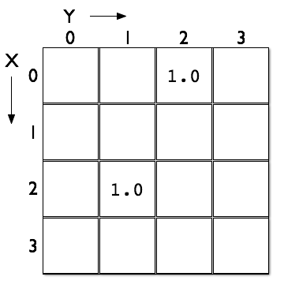

---
# Copyright 2017 Yahoo Holdings. Licensed under the terms of the Apache 2.0 license. See LICENSE in the project root.
title: "Introduction to working with tensors in Vespa"
---

Tensors allow Vespa to support more advanced ranking models
such as large logistic regression models and neural networks.
In this document, tensors are introduced with some examples of use.
For details, refer to the [tensor user guide](tensor-user-guide.html)
and the [tensor reference](reference/tensor.html).
Also try the [blog recommendation](tutorials/blog-recommendation.html) tutorial.

## Tensor concepts
In Vespa, a tensor is a data structure which is a generalization of scalars, vectors and matrices.
Tensors can have any order:

- A scalar is a tensor of order 0.
- A vector is a tensor of order 1.
- A matrix is a tensor of order 2.

Tensors consist of a set of double valued cells, with each cell having a unique address.
A cell's address is specified by its index or label along all dimensions.
The number of dimensions in a tensor is the _order_ of the tensor.
Each dimension can be either _sparse_ or _dense_.
Sparse dimensions have labels designating their address,
while dense dimensions have indices.

Example: Using [literal form](reference/tensor.html), the tensor:

    {
        {x:2, y:1}:1.0,
        {x:0, y:2}:1.0
    }

has two dimensions named `x` and `y`, and has two cells with defined values:

A type declaration is needed for tensors. This defines a sparse matrix:

    tensor(x{},y{})

This is a dense matrix:

    tensor(x[],y[])
    
Combination:

    tensor(x[],y{})

Vespa uses the tensor type to optimize the ranking pipeline.
As seen above, the dimensions themselves define if they are sparse or dense.

## Tensor examples
The following examples, uses the tensor playground to visualize tensor operations.
The playground can be started by deploying the
[tensor sample app](https://github.com/vespa-engine/sample-apps/tree/master/basic-search-tensor)
and opening "http://[host]:[port]/playground/index.html".
By clicking on the links below, a setup string will be copied to the clipboard -
paste the string into the setup input box in the playground and press enter.

1. <a href="#dense_dot_product" onclick="copyToClipboard('N4KABGBEBmBOCGBbApgZ0gLjAbXBMo++kA9gA6ZQDGJiKAdgC6QA0eRkZ8CilhRxRsgAezLJAAiyeqmRghMkrDAATEozBlYJFQFcqzdvgC+R42yL8O5SpABu3AJbwARgBtkrIxE7ckfb2J6JE9xAEEvAUEATzJQqAVUJQAKYWwAZgBdAEpIqKgHN114yGBgYQwARmMMAAYAOmrIQNMicyMrYhtxB1hnd08LAV8eAPyoYJRbACE8qMhGWJLElLSs3KH5wuLbMoramobKlnKqw-qAJmNmqNaTTYJA0gpxES00VEcSejniLlGsJ0OJMSr8OG9YB8vj9wmAAFRgWYtMwPIFQbpQCFQ75gqD-fyAwI+EG2XE+LGoT448SoXSIZJhOHTXLItqop4YyAUqk-B4+fG8QnjSAk8RkzHCd6U6G2SF6KjIZIAKxIjnoDJYiM10FSLGi2VScP12U1tMQLNuZjwmRAxiAA')">Dense tensor dot product</a>
1. <a href="#sparse_dot_product" onclick="copyToClipboard('N4KABGBEBmBOCGBbApgZ0gLjAbXBMo++kA9gA6ZQDGJiKAdgC6QA0eRkZ8CilhRxRsgAezLJADKXWKmRgh9VCVhgAJiUZgysEqoCuVZu3wBfYybZF+HcpUgA3bgEt4AIwA2yVsYiduSPh9ieiQvcQBBbwFBAE8yMKgFJVgACmFgEwBKKOioR3c9BMhgYGEMAEYTDAAGADpKyCCzIgtja2JbcUdYFw8vSwE-HkDcqBCUOwAhHOjIRjiipOU0jOyB2fzCuxKy6qq68pZSiv3agCYTRujm03WCINIKcRFtNFQnEnoZ4mkArHaOOMit8OC9YG8Pl8ImAAFRgaZNcx3AFQTpQMEQz4gqC-Xj-IK+IF2bG+DGod5Y8SoPSIFLhGGTFhgYTZREtZEPNGQMkUr53Xy4ka5SBE8Qk9HCV7kyF2cH6KjIFIAKxITnodKZjLA0DSLBimTSMP1mSZ1MQrOu5jwAF0QCYgA')">Sparse tensor dot product</a>
1. <a href="#vector_matrix_product" onclick="copyToClipboard('N4KABGBEBmBOCGBbApgZ0gLjAbXBMo++kA9gA6ZQDGJiKAdgC6QA0eRkZ8CilhRxRsgAezLJABqyKoxKwAtIniNYAS2FgysEgBMArjIB0kdvgC+ps2yL8O5SpABu3VfABGAG2StTETtyQ+X2J6JG9xCR8BQQBPMnCoIXpUOQAKYWwAZgBdAEoo6KhnDz0EyGBgYQwABjMawwBWFkqMAEY66sbmqoAmDsazE2iLIitTW2J7cWc1dy8Cji4eIMKoUJQHAFkFgUhGOLKklNhUqizslgyc-OtCp3gSsoqqGsuajuaX6rf2+tbP169fo9AH-Kq1Nqgn51VqGf7AF5gjB9NqGEEI5FvCHol4gqq-HpwgF45F1Ql9IYCEbmW4QCZ+KZQERaNCoVQkeg7PxLQJYekhMIOLnEZmwVnszniVB6RCpCRgABUYE2LDAwnywWpEDGNmCpAo4hodGQTGF-mWfOCfiEogcADkSEIwIwABbKZ0u5BgOQ6ZCwb3QMCIPQeRiqMgeVRUZQSsA6EhoegAckYQeUQlghjAAElU6pUB6vTpVAw2RznSQwNLEN7HH6Pe6lIwM6hjJrLLSCHrGZBReKOWaebxLatIOsysK-H3UGXJVBq6lNoqwBJVerKaMO+NuwamcIWTOJYOAsOu6Px0LOxxp7OHGL9FRkKkAFYkVT0OWqlVgaDpFgxXJ0mXADclVas1w1YZLDwbIQDMIA')">Vector-matrix product</a>
1. <a href="#matrix_matrix_product" onclick="copyToClipboard('N4KABGBEBmBOCGBbApgZ0gLjAbXBMo++kA9gA6ZQDGJiKAdgC6QA0eRkZ8CilhRxRsgAezLJACiwpGQA2yMCWhh4YRPEawAlsIC06zTrBlYJACYBXKowB0kdvgC+Dx2yL8O5SpABu3LfAARvKsDhCc3Eh8YcT0SMjeAIKhAoIAnmQJ4kL0qCSwABTCwK5pJQCUKalQfrIWWVDAADr0wMIYAAwsaZ2OnSwtbf09AIx9HTYjA63tUz0dfVODs90YY2uTLY72qc5Erg4exF7iftpBIW4CETzR1VBxKN4AQlWpkIwZDR-IufkFZVcAC8Km9rrV6t5mq15iwgb1+oNYfD1ksYWs4QiJmjgKNMajNvRtjE9k4rhAjuETlARCY0KgtCR6GDwlxblhKbF4t4WcRabB6YzmeJEmAAFRgV4klzkggxUgUcT8wVM3k3KIcmLhR7fXnhZWoBmq8SoCyIAqiiXPFhgNKVaX7WWchXeA1G5my1mRXia+6QHU8z184R0w1C7wCyxUZAFABWJC09AtLGt0CK3XKRTFdvKLFNiAzOwEpIgpIAuiBHEA')">Matrix-matrix product</a>
1. <a href="#tensor_generation" onclick="copyToClipboard('N4KABGBEBmBOCGBbApgZ0gLjAbXBMo++kA9gA6ZQDGJiKAdgC6QA0eRkZ8CilhRxRsgAezLJADEEsABVk9VCVhgA5vOQJGASxL0WYACZaGqHfTCx5SLfRVh49A2Br0q8IfXdnI7fAF9fPzYifg5ySkgRMktUU11WXwhObiQ+ROJPFAiAQQSBYiiYuPoIj0VYAAotbABmAF0ASiqGn3yAoiDfUOJw8UK0YryBZJ40-KTM5AiAISH8yOFoge9xMqUq7AAmRqqAahqW9Pb-YPxupN6oftjvU44uUaxzjKQp8QBhOeHrwfEXN0YFWyLGmLC0hzagTuBHSpAofUWRVusIeqSe6QmrwiXw4PxWUEskwq730Wn0wghAmOEGOdRAfiAA')">Tensor generation, dimension renaming and concatenation</a>
1. <a href="#neural_network" onclick="copyToClipboard('N4KABGBEBmBOCGBbApgZ0gLjAbXBMo++kA9gA6ZQDGJiKAdgC6QA0eRkZ8CilhRxRsgAezLJAByyAK4IANmHrJGAdxKwA1mBFIyc5JHb4AvkeNsi-DuUqQAbtwCW8AEb7WRiJ25I+n4vRIBuKO9GTSzBYCXowAnmTBUEL0qOoAFKHhjNgAzAC6AJQe0V4OctKJkMDAmREYAAzGDQB0AIwsNWF1rU31bR21jBgATL1txobRpkTmRlbENuIOsM5uBlEcXDx+JVCBKLYqABaOACanyPTFJZBxCbbJqbAZXdn5LCfnl9gArIXX0Xs8HKlWqnwu9AaLEGDSaAFo+gB2VoADgAnMMOuDLhh2jDGrjmmi0a1hiisWcISNoa9YS16gAWBmoilfSE5GlZOkItoo4YMjnAbGQhmcuoEvr1fnE1lU+pioY9FoANhRiJRP1lOLxtKVcNazWV-J+5KFlJxmJhSr6wxyyplZrZGA5VrGyp+iMRosdVNFrpaPzR7tNwqhMNGGH1zR+TOV3tDOq5EZtaPqjK1kMttOTbWVytamp9OJd2aaBq9rRyIfNIoVIzGOVaAp+E380xMGwI-lIFCWTlc7k7Xi2viw8w4+0qLmFAIEt3ilUe6WFv3+Q+IZQqtjBNbpNpRUsRGdxYylHsLoZzafq+ePOTGw3zrXaRZF8L6rTz9TRramZk745QIsUDLKsg7diOvBjv4XiToc0ChMCs4cHci6XE8aQrn8LAIYEcjYK0a4wSBwJbuIO5OvKuHAtyyrNHyPyqse7TUXI3LPtGPzDOqx6Yqx3KSo2aJHq+zo4YhbEEjknGIo+x6ivxBI8naiI5Iiv4CO2ECzJY3bAUCKwDusEE+FBXa7JAcHiC4rHIYIC4POh6SsQRREWZuoLAIpp7uoiyqNJMmn-nMem9tQtAMJEJnbNBFlCKItgAGKOLAqCMGAcjwLEyCwGA8BUIwjgOIVJCQoFMzBbpgL6SIZCwGgqCOKVdneDF5k3FZUB2V4tX1agjXNeIqDSIgLxZGAABUYDHDWLBgIMBRgAA1GA041uVJiVfggE9rYvUNU1Vzrq1o7tYCnWQJl2WwK03VQPt-WHbY9XlGkw2jYMk3TcKc0Lctq3CkUbZbRAO01cIdUHc1x2QTsHVBLYwJCLAgSFXYyAAPpXTlt3rj1EN9QNVziC90hpMIKgY3o0ioBjLhjREc0zWyc1rSz82vAUQN-jMAGhbYNB0JcUWArDsU3PFYhQMleEZVlOV5QVRXwCVZXA7zIXVWFkAPUTLVi2dc4XXdOsE1DxNQO9aTYzdX0qKxc2A-9NkSRt2kg4bXjg5Dj3Q9Fp2AbBCPiDbwwm7rT1DY4ADmiAkGcb0jdb8u21N9sSY7NaLStLt4dzQUa1Vc76YLkX66ZcOApLSUSWACD0FoqA0PVGBu2AWnt3zWt7WbvtHf7ZmB3swddXj9293rQ1J6H+cVXPYB5CAxhAA')">Neural network</a>

The neural network example is quite a bit more involved.
Here, the network has 3 input neurons, 5 hidden neurons and a single output neuron.
An example of neural networks in action can be found in the
[blog recommendation tutorial part 3](tutorials/blog-recommendation-nn.html).
