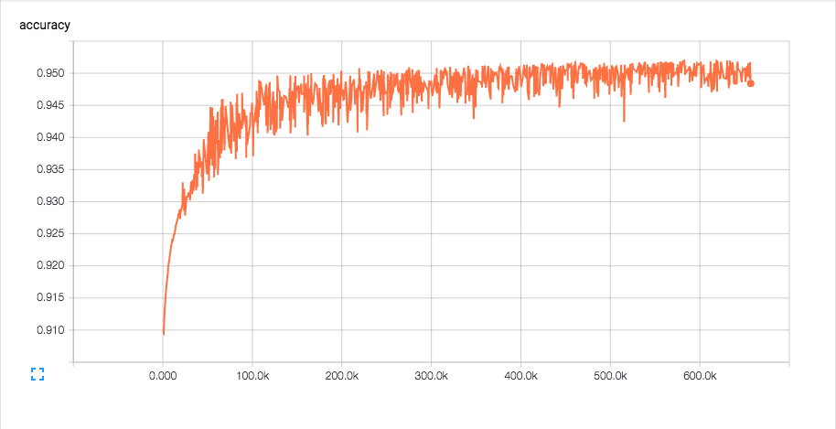
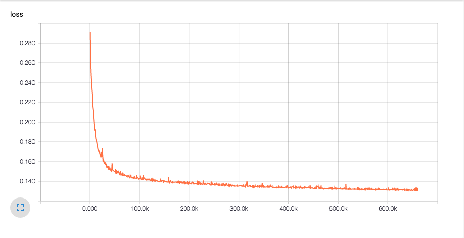

---
# Copyright 2017 Yahoo Holdings. Licensed under the terms of the Apache 2.0 license. See LICENSE in the project root.
title: "Vespa tutorial pt. 3: Blog recommendation with Neural Network models"
---

* TOC
{:toc}


## Introduction

The main objective of this tutorial is to show how to deploy neural network
models in Vespa using our Tensor Framework. In fact, any model that can be
represented by a series of Tensor operations can be deployed in Vespa.  Neural
network is just a popular example. In addition, we will introduce the
multi-phase ranking model available in Vespa that can be used to run more
expensive models in a phase based on a reduced number of documents returned by
previous phases. This feature allow us to run models that would be
prohibitively expensive to use if we had to run them at query-time across all
the documents indexed in Vespa.

This tutorial builds upon [Vespa tutorial pt. 2](blog-recommendation.html), and
therefore reading it is necessary to fully understand the ideas presented here.

## Model Training

In this section, we will define a neural network model, show how we created a
suitable dataset to train the model and train the model using TensorFlow.

### The neural network model

In the Vespa tutorial pt. 2, we computed latent factors for each user and each
document and then used a dot-product between user and document vectors to rank
the documents available for recommendation to a specific user. In this tutorial
we will train a 2-layer fully connected neural network model that will take the
same user ( $$u$$ ) and document ( $$d$$ ) latent factors as input and will
output the probability of that specific user liking the document.

More technically, in the Vespa tutorial pt. 2 our rank function $$r$$ was given
by

$$r(u,d)= u * d$$

while in this tutorial it will be given by

$$r(u,d, \theta)= f(u, d, \theta)$$

where $$f$$ represents the neural network model described below and $$\theta$$
is the neural network parameter values that we need to learn from training
data.

The specific form of the neural network model used here is

$$p = \text{sigmoid}(h_1 \times W_2 + b_2)$$

$$h_1 = \text{ReLU}(x \times W_1 + b_1)$$

where $$x = [u, d]$$ is the concatenation of the user and document latent
factor, ReLU is the rectifier activation function, sigmoid represents the
sigmoid function, p is the output of the model and in this case can be
interpreted as the probability of the user u liking a blog post d. The
parameters of the model are represented by $$\theta = (W_1, W_2, b_1, b_2)$$.

### Training data

For the training dataset, we will start with the (user_id, post_id) rows from
the "training_set_ids" generated in the section [Training and test
sets](blog-recommendation.html#training-and-test-sets) of the previous
tutorial. Then, we remove every row for which there is no latent factors for
the user_id or post_id contained in that row. This gives us a dataset with only
positive feedback (label = 1), since each row represents one instance of a
user_id liking a post_id.

In order to train our model, we need to generate negative feedback (label = 0).
So, for each row (user_id, post_id) in the current dataset we will generate N
negative feedback rows by randomly sampling post_id_fake from the pool of
post_id's available in the current set, so that for each (user_id, post_id) row
with label = 1 we will increase the dataset with N (user_id, post_id_fake) rows
with label = 0.

<!-- Pre computed dataset can be found [here](link here when published) and -->
Find code to generate the dataset in the [utility
scripts](https://github.com/vespa-engine/sample-apps/tree/master/blog-tutorial-shared#create-training-dataset).

### Training with TensorFlow

With the training data in hand, we have split it into 80% training set and 20%
validation set and used TensorFlow to train the model. The script used can be
found in the [utility
scripts](https://github.com/vespa-engine/sample-apps/tree/master/blog-tutorial-shared#train-model-with-tensorflow)
and executed by

	$ python vespaModel.py --product_features_file_path vespa_tutorial_data/user_item_cf_cv/product.json \
	                       --user_features_file_path vespa_tutorial_data/user_item_cf_cv/user.json \
	                       --dataset_file_path vespa_tutorial_data/nn_model/training_set.txt

The progress of your training can be visualized using Tensorboard

	$ tensorboard --logdir runs/*/summaries/

Below we see the accuracy and loss metrics plotted after every 1000 training steps:

<div style="text-align:center"></div>

<div style="text-align:center"></div>

## Model deployment in Vespa

### Two Phase Ranking

When a query is sent to Vespa, it will scan all documents available and select
the ones (possibly all) that match the query. When the set of documents
matching a query is found, Vespa must decide the order of these documents.
Unless explicit sorting is used, Vespa decides this order by calculating a
number for each document, the rank score, and sorts the documents by this
number.

The rank score can be any function that takes as arguments parameters sent by
the query, document attributes defined in search definitions and global
parameters not directly linked to query or document parameters. One example of
rank score is the output of the neural network model defined in this tutorial.
The model takes the latent factor $$u$$ associated with a specific
```user_id``` (query parameter), the latent factor $$d$$ associated with
document ```post_id``` (document attribute) and learned model parameters
(global parameters not related to a specific query nor document) and returns
the probability of user $$u$$ to like document $$d$$.

However, even though Vespa is designed to carry out such calculations
optimally, complex expressions becomes expensive when they must be calculated
over every one of a large set of matching documents. To relieve this, Vespa can
be configured to run two ranking expressions - a smaller and less accurate one
on all hits during the matching phase, and a more expensive and accurate one
only on the best hits during the reranking phase. In general this allows a more
optimal usage of the cpu budget by dedicating more of the total cpu towards the
best candidate hits.

The reranking phase, if specified, will by default be run on the 100 best hits
on each search node, after matching and before information is returned upwards
to the search container. The number of hits to rerank can be turned up or down as needed.
Below is a toy example showing how to configure first and second phase ranking
expressions in the rank profile section of search definitions where the second
phase rank expression is run on the 200 best hits from first phase on each
search node.

	search myapp {

	    …

	    rank-profile default inherits default {

	        first-phase {
	            expression: nativeRank + query(deservesFreshness) * freshness(timestamp)
	        }

	        second-phase {
	            expression {
	                0.7 * ( 0.7*fieldMatch(title) + 0.2*fieldMatch(description) + 0.1*fieldMatch(body) ) +
	                0.3 * attributeMatch(keywords)
	            }
	            rerank-count: 200
	        }
	    }
	}

### Constant Tensor files

Once the model has been trained in TensorFlow, export the model
parameters $$(W_1, W_2, b_1, b_2)$$ to the application folder as Tensors
according to the [Vespa Document JSON format](../reference/document-json-format.html).

The complete code to serialize the model parameters using Vespa Tensor format
can be found  in the [utility
scripts](https://github.com/vespa-engine/sample-apps/tree/master/blog-tutorial-shared#export-model-parameters-to-tensor-vespa-format)
but the following code snipped shows how to serialize the hidden layer weights
$$W_1$$:

	serializer.serialize_to_disk(variable_name = "W_hidden", dimension_names = ['input', 'hidden'])

Note that Vespa currently requires dimension names for all the Tensor
dimensions (in this case $$W_1$$ is a matrix, therefore dimension is 2).

In the following section, we will use the following code in the ```blog_post```
search definition in order to be able to use the constant tensor ```W_hidden```
in our ranking expression.

	    constant W_hidden {
	        file: constants/W_hidden.json
	        type: tensor(input[20],hidden[40])
	    }

A constant tensor is data that is not specific to a given document type. In the
case above we define ```W_hidden``` to be a tensor with two dimensions
(matrix), where the first dimension is named input and has size 20 and second
dimension is named hidden and has size 40. The data were serialized to a JSON
file located at ```constants/W_hidden.json``` relative to the application
package folder.

### Vespa ranking expression

In order to evaluate the neural network model trained with TensorFlow in the
previous section, we need to translate the model structure to a Vespa ranking
expression to be defined in the ```blog_post``` search definition. To honor a
low-latency response, we will take advantage of the Two Phase Ranking available
in Vespa and define the first phase ranking to be the same ranking function
used in the Vespa tutorial pt. 2, which is a dot-product between the user and
latent factors. After the documents have been sorted by the first phase ranking
function, we will rerank the top 200 document from each search node using the
second phase ranking given by the neural network model presented above.

Note that we define two ranking profiles in the search definition below. This
allow us to decide which ranking profile to use at query time. We defined a
ranking profile named ```tensor``` which only applies the dot-product between
user and document latent factors for all matching documents and a ranking
profile named ```nn_tensor```, which rerank the top 200 documents using the
neural network model discussed in the previous section.

We will walk through each part of the ```blog_post``` search definition, see
[blog_post.sd](https://github.com/vespa-engine/sample-apps/tree/master/blog-recommendation/src/main/application/searchdefinitions/blog_post.sd).

As always, we start the a search definition with the following line

	search blog_post {

We define the document type ```blog_post``` the same way we have done in the
previous tutorial.

	    document blog_post {

	      # Field definitions
	      # Examples:

	      field date_gmt type string {
	          indexing: summary
	      }
	      field language type string {
	          indexing: summary
	      }

	      # Remaining fields as found in previous tutorial

	    }

We define a ranking profile named ```tensor``` which rank all the matching
documents by the dot-product between the document latent factor and the user
latent factor. This is the same ranking expression used in the previous
tutorial, which include code to retrieve the user latent factor based on the
```user_id``` sent by the query to Vespa.

	    # Simpler ranking profile without
	    # second-phase ranking
	    rank-profile tensor {
	      first-phase {
	          expression {
	              sum(query(user_item_cf) * attribute(user_item_cf))
	          }
	      }
	    }

Since we want to evaluate the neural network model we have trained, we need to
define where to find the model parameters $$(W_1, W_2, b_1, b_2)$$. See
previous section for how to write the TensorFlow model parameters to Vespa
Tensor format.

	    # We need to specify the type and the location
	    # of the files storing tensor values for each
	    # Variable in our TensorFlow model. In this case,
	    # W_hidden, b_hidden, W_final, b_final

	    constant W_hidden {
	        file: constants/W_hidden.json
	        type: tensor(input[20],hidden[40])
	    }

	    constant b_hidden {
	        file: constants/b_hidden.json
	        type: tensor(hidden[40])
	    }

	    constant W_final {
	        file: constants/W_final.json
	        type: tensor(hidden[40], final[1])
	    }

	    constant b_final {
	        file: constants/b_final.json
	        type: tensor(final[1])
	    }

Now, we specify a second rank-profile called ```nn_tensor``` that will use the
same first phase as the rank-profile ```tensor``` but will rerank the top 200
documents using the neural network model as second phase. We refer to the
[Tensor Reference document](../reference/tensor.html) for more information
regarding the Tensor operations used in the code below.

	    # rank profile with neural network model as
	    # second phase
	    rank-profile nn_tensor {

	        # The input to the neural network is the
	        # concatenation of the document and query vectors.

	        macro nn_input() {
	            expression: concat(attribute(user_item_cf), query(user_item_cf), input)
	        }

	        # Computes the hidden layer

	        macro hidden_layer() {
	            expression: relu(sum(nn_input * constant(W_hidden), input) + constant(b_hidden))
	        }

	        # Computes the output layer

	        macro final_layer() {
	            expression: sigmoid(sum(hidden_layer * constant(W_final), hidden) + constant(b_final))
	        }


	        # First-phase ranking:
	        # Dot-product between user and document latent factors

	        first-phase {
	            expression: sum(query(user_item_cf) * attribute(user_item_cf))
	        }

	        # Second-phase ranking:
	        # Neural network model based on the user and latent factors

	        second-phase {
	            rerank-count: 200
	            expression: sum(final_layer)
	        }

	    }

	}

## Offline evaluation

We will now query Vespa and obtain 100 blog post recommendations for each ```user_id```
in our test set. Below, we query Vespa using the ```tensor``` ranking function which
contain the simpler ranking expression involving the dot-product between user and
document latent factors.

	pig -x local -f tutorial_compute_metric.pig \
	  -param VESPA_HADOOP_JAR=vespa-hadoop.jar \
	  -param TEST_INDICES=blog-job/training_and_test_indices/testing_set_ids \
	  -param ENDPOINT=$(hostname):8080
	  -param NUMBER_RECOMMENDATIONS=100
	  -param RANKING_NAME=tensor
	  -param OUTPUT=blog-job/cf-metric

We perform the same query routine below, but now using the ranking-profile ```nn_tensor```
which reranks the top 200 documents using the neural network model.

	pig -x local -f tutorial_compute_metric.pig \
	  -param VESPA_HADOOP_JAR=vespa-hadoop.jar \
	  -param TEST_INDICES=blog-job/training_and_test_indices/testing_set_ids \
	  -param ENDPOINT=$(hostname):8080
	  -param NUMBER_RECOMMENDATIONS=100
	  -param RANKING_NAME=nn_tensor
	  -param OUTPUT=blog-job/cf-metric

The ```tutorial_compute_metric.pig``` script can be found [in our
repo](https://github.com/vespa-engine/sample-apps/tree/master/blog-tutorial-shared#offline-evaluation).

Comparing the recommendations obtained by those two ranking profiles and our
test set, we see that by deploying a more complex and accurate model in the
second phase ranking, we increased the number of relevant documents (documents
read by the user) retrieved from 11948 to 12804 (more than 7% increase) and
those documents retrieved appeared higher up in the list of recommendations, as
shown by the expected percentile ranking metric introduced in the Vespa
tutorial pt. 2 which decreased from 37.1% to 34.5%.

