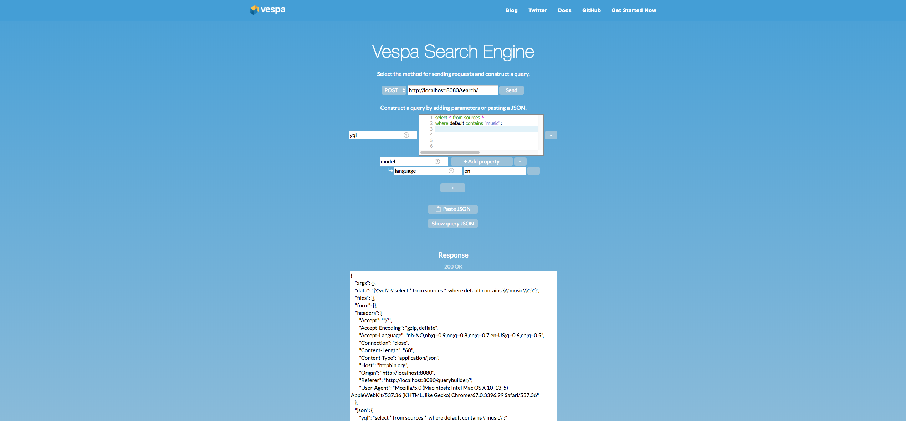

---
# Copyright Verizon Media. Licensed under the terms of the Apache 2.0 license. See LICENSE in the project root.
title: "News Search Tutorial"
---

## Introduction

Our goal with this tutorial series is to set up a Vespa application for personalized
news recommendation. We will do this in stages, starting with a simple news search
system, and gradually add functionality as we go through the parts of the tutorial.

The parts are:

1. A search system that introduces Vespa applications, with basic functionality
   such as feeding, searching, sorting, ranking, and grouping.
2. A personalized recommendation system with more advanced functionality such
   as vector search using approximate nearest neighbors with filtering and
   custom Java code.
3. An improved recommendation system that uses machine learning models during
   handling of a query for handling, among other things, the cold start
   problems.

During these tutorials we will use the [Microsoft News
Dataset](https://msnews.github.io/) (MIND).  This is a large-scale dataset for
news recommendation research. It contains over 160.000 articles, 15 million
impressions logs, and 1 million users. We will not use the full dataset in this
tutorial. To make the tutorial easier to follow along we will use the much
smaller DEMO part containing only 5000 users. However, readers are free to
use the entire dataset at their own discretion.

<!--
# TODO: different requirements for stand alone vs cloud etc
-->

### Prerequisites

It is advisable to have run the [vespa quick start
guide](../vespa-quick-start.html) before starting this tutorial, as this
tutorial has similar requirements. In addition, we require Python 3 for
downloading the dataset and converting it to a format suitable for Vespa.

In the next part of this series, we will have some additional python dependencies
as we use PyTorch to train vector representations for news and users and train
machine learning models for use in ranking.

In the following we will create a Vespa application from scratch, so make
sure you are in an empty working directory before issuing the following commands.

To make things a bit easier to download and feed the data to Vespa, we will use
some code from the [sample app
repository](https://github.com/vespa-engine/sample-apps). Lets clone that into
a `sample-apps` directory in your working directory:

<pre data-test="exec">
$ git clone --depth 1 https://github.com/vespa-engine/sample-apps.git
</pre>

### The MIND dataset

Please refer to the [MIND dataset
description](https://github.com/msnews/msnews.github.io/blob/master/assets/doc/introduction.md)
for an introduction to the contents of this dataset. For this tutorials, there are
particularly two pieces of data that we will use:

- News article content which contain data such as title, abstract, news
  category, and entities extracted from the title and abstract.
- Impressions which contain a list of news articles that were shown to a user,
  labelled with whether or not the user clicked on them.

For this part of the tutorial, we will only use the news content. We will
use the impression data in the next tutorial for building a recommendation
system.

## Searching news articles

In terms of data, Vespa operates with the notion of
[documents](../documents.html).  A document represents a single, searchable
item in your system, e.g., a news article, a photo, or a user. Each document
type must be defined in the Vespa configuration through a
[schema](../schemas.html).  Think of the document type in a schema as being
similar to a table definition in a relational database - it consists of a set
of fields, each with a given name, a specific type, and some optional
properties.

As an example, for this simple news search application, we could create the
document type `news` with the following fields:

<table class="table">
<thead>
</thead>
<tbody>
  <tr> <th>title</th><td>of type string</td> </tr>
  <tr> <th>abstract</th><td>of type string</td> </tr>
  <tr> <th>body</th><td>of type string (string fields can be of any length)</td></tr>
  <tr> <th>category</th><td>of type string</td></tr>
  <tr> <th>date</th><td>of type int (to store a timestamp of published date)</td> </tr>
</tbody>
</table>

The data fed into Vespa must match the structure of the schema, and the results
returned when searching will be on this format as well.

## Application Packages

A Vespa [application package](../cloudconfig/application-packages.html) is the
set of configuration files and Java plugins that together define the behavior
of a Vespa system: what functionality to use, the available document types, how
ranking will be done and how data will be processed during feeding and
indexing.  The schema, e.g., `news.sd`, is a required part of an
application package — the other required files are `services.xml` and
`hosts.xml`.

As an example, the sample application [news
search](https://github.com/vespa-engine/sample-apps/tree/master/news-search)
creates a simple but functional news search engine. The application
package is found in
[src/main/application](https://github.com/vespa-engine/sample-apps/tree/master/news-search/src/main/application).
In the following tutorial we will recreate this application from scratch.
Create a new folder where we will place our application package:

<pre data-test="exec">
$ mkdir application
</pre>

### Services Specification

The [services.xml](../reference/services.html) file defines the services that
make up the Vespa application — which services to run and how many nodes per
service.  Write the following to `application/services.xml`:

<pre data-test="file" data-path="application/services.xml">
<?xml version='1.0' encoding='UTF-8'?>
<services version='1.0'>

  <container id='default' version='1.0'>
    <search></search>
    <document-api></document-api>
    <nodes>
      <node hostalias='node1'></node>
    </nodes>
  </container>

  <content id='news' version='1.0'>
    <redundancy>1</redundancy>
    <search>
      <visibility-delay>1.0</visibility-delay>
    </search>
    <documents>
      <document mode='index' type='news'></document>
    </documents>
    <nodes>
      <node hostalias='node1' distribution-key="0"></node>
    </nodes>
  </content>

</services>
</pre>

Here:

- `<container>` defines the [container cluster](../jdisc/index.html) for
  document, query and result processing
- `<search>` sets up the [query endpoint](../query-api.html).  The default port
  is 8080.
- `<document-api>` sets up the [document
  endpoint](../reference/document-v1-api-reference.html) for feeding.
- `<nodes>` defines the nodes required per service.  (See the
  [reference](../reference/services-container.html) for more on container
  cluster setup.)
- `<content>` defines how documents are stored and searched
- `<redundancy>` denotes how many copies to keep of each document.
- `<documents>` assigns the document types in the _schema_ — the content
  cluster capacity can be increased by adding node elements — see [elastic
  Vespa](../elastic-vespa.html). (See also the
  [reference](../reference/services-content.html) for more on content cluster
  setup.)
- `<nodes>` under `content` defines the hosts for the content cluster.

### Deployment Specification

The [hosts.xml](../reference/hosts.html) file contains a list of all the
hosts/nodes that are part of the application, with an alias for each of them.
This tutorial uses a single node. Write the following to
`application/hosts.xml`:

<pre data-test="file" data-path="application/hosts.xml">
<?xml version="1.0" encoding="utf-8" ?>
<hosts>
  <host name="localhost">
    <alias>node1</alias>
  </host>
</hosts>
</pre>

This sets up the alias `node1` to represent the local host.

### Schema

The `news` document type mentioned in the `services.xml` file above is defined
in a schema.  Write the following to `application/schemas/news.sd`, as it
contains the schema for a document of type `news`. Note that the file must
have the same name as the document type mentioned in `services.xml`.

<pre data-test="file" data-path="application/schemas/news.sd">
schema news {
    document news {
        field category type string {
            indexing: summary | attribute
        }
        field subcategory type string {
            indexing: summary | attribute
        }
        field title type string {
            indexing: index | summary
            index: enable-bm25
        }
        field abstract type string {
            indexing: index | summary
            index: enable-bm25
        }
        field body type string {
            indexing: index | summary
            index: enable-bm25
        }
        field url type string {
            indexing: index | summary
        }
        field date type int {
            indexing: summary | attribute
        }
        field clicks type int {
            indexing: summary | attribute
        }
        field impressions type int {
            indexing: summary | attribute
        }
    }

    fieldset default {
        fields: title, abstract, body
    }

}
</pre>

The `document` is wrapped inside another element called `search`.  The name
following these elements, here `news`, must be exactly the same for both.

The field property `indexing` configures the _indexing pipeline_ for a field,
which defines how Vespa will treat input during indexing — see [indexing
language](../reference/advanced-indexing-language.html).  Each part of the
indexing pipeline is separated by the pipe character '|':

- `index:` Create a search index for this field.
- `attribute:` Store this field in memory as an [attribute](../attributes.html)
  — for [sorting](../reference/sorting.html), [querying](../query-api.html) and
  [grouping](../grouping.html).
- `summary:` Lets this field be part of the [document
  summary](../document-summaries.html) in the result set.

## Deploy the Application Package

We've written the three necessary files to the `application` folder, and we are
done with the application package. Let's start the application. First, we
need to start Vespa by running a Docker container:

<pre data-test="exec">
$ docker run -m 10G --detach --name vespa --hostname vespa-tutorial \
    --volume `pwd`:/app --publish 8080:8080 vespaengine/vespa
</pre>

This can take a short while. Before continuing, make sure that the
configuration server is running - signified by a `200 OK` response:

<pre data-test="exec" data-test-wait-for="200 OK">
$ docker exec vespa bash -c 'curl -s --head http://localhost:19071/ApplicationStatus'
</pre>

Now, after the previous command returned a `200 OK`, which can take around
30 seconds or so, we can deploy our application:

<pre data-test="exec">
$ docker exec vespa bash -c '/opt/vespa/bin/vespa-deploy prepare /app/application && \
    /opt/vespa/bin/vespa-deploy activate'
</pre>

(or alternatively, run the equivalent commands inside the docker container).

This prints that the application was activated successfully and also the
checksum, timestamp and generation for this deployment (more on that later).

After a short while, pointing a browser to
[http://localhost:8080/ApplicationStatus](http://localhost:8080/ApplicationStatus)
returns JSON-formatted information about the active application, including its
checksum, timestamp and generation (and should be the same as the values when
`vespa-deploy activate` was run).  The generation will increase by 1 each time
a new application is successfully deployed, and is the easiest way to verify
that the correct version is active.

The Vespa node is now configured and ready for use.

<pre style="display:none" data-test="exec" data-test-wait-for="200 OK">
$ curl -s --head http://localhost:8080/ApplicationStatus
</pre>

## Feeding data

First, we need to download the data. The sample applications that were
cloned earlier contains a script to help us do that:

<pre data-test="exec" >
$ ./sample-apps/news-search/bin/download-mind.sh demo
</pre>

The argument defines which dataset to download. Here, we download the `demo`
dataset, but `small` and `large` are valid options. Both the training and
validation parts are downloaded to a directory called `mind`. The `demo`
dataset is around 27 Mb.

The data fed to Vespa must match the schema for the document type.  The data
just downloaded, must be converted to a valid Vespa document format before it
can be fed to Vespa. Again, we have a script to help us with this:

<pre data-test="exec" >
$ python3 sample-apps/news-search/src/python/convert_to_vespa_format.py mind
</pre>

The argument is where to find the downloaded data above, which was in the `mind` directory.
This script creates a new file in that directory called `vespa.json`. This contains
all 28603 news articles in the data set. This file can now be fed to Vespa. Here, we
will use the [Java feeding API](../vespa-http-client.html):

<pre data-test="exec" >
$ docker exec vespa bash -c 'java -jar /opt/vespa/lib/jars/vespa-http-client-jar-with-dependencies.jar \
    --verbose --file /app/mind/vespa.json --host localhost --port 8080'
</pre>

### Track feeding progress

You can use the [Metrics API](../reference/metrics.html) to track number of documents indexed:

<pre data-test="exec" data-test-assert-contains='"content.proton.documentdb.documents.active.last":28603'>
$ docker exec vespa bash -c 'curl -s http://localhost:19092/metrics/v1/values' | tr "," "\n" | grep content.proton.documentdb.documents.active
</pre>

You can also inspect the search node state by:

<pre data-test="exec" data-test-assert-contains='"onlineDocs", "28603"'>
$ docker exec vespa bash -c '/opt/vespa/bin/vespa-proton-cmd --local getState'
</pre>

### Fetch documents

You can verify that specific documents are fed by fetching documents by
document id using the [Document API](../api.html):

<pre data-test="exec" data-test-assert-contains="id:news:news::N10864">
$ curl -s 'http://localhost:8080/document/v1/news/news/docid/N10864' | python -m json.tool
</pre>

## The first query

Searching with Vespa is done using HTTP GET or HTTP POST requests, like:

    <host:port>/search?yql=value1&param2=value2...

or with a JSON-query:  

    {
    	"yql" : value1,
    	param2 : value2,
    	...
    }

The only mandatory parameter is the query, using `yql=<yql query>`. More
details can be found in the [Query API](../query-api.html).

Given the above schema, where the fields `title`, `abstract` and `body` are
part of the `fieldset default`, any document containing the word "music" in one
or more of these two fields matches the queries below:

Please copy the JSON-query below and paste it in the GUI for building queries
at [http://localhost:8080/querybuilder/](http://localhost:8080/querybuilder/),
which can help you build queries with e.g. autocompletion of YQL:

	{ "yql" : "select * from sources * where default contains \"music\";" }

or run one of the lines below.

<pre data-test="exec" data-test-assert-contains='"coverage": 100'>
$ curl -s -H "Content-Type: application/json" --data '{"yql" : "select * from sources * where default contains \"music\";"}' \
http://localhost:8080/search/ | python -m json.tool
</pre>

<pre data-test="exec" data-test-assert-contains='"coverage": 100'>
$ curl -s 'http://localhost:8080/search/?yql=select+*+from+sources+*+where+default+contains+%22music%22%3B' | python -m json.tool
</pre>

Looking at the output, please note:

- The field `documentid` in the output and how it matches the value
  we assigned to each put operation when feeding data to Vespa.
- Each hit has a property named relevance, which indicates how well the given
  document matches our query, using a pre-defined default ranking function. You
  have full control over ranking — more about ranking and ordering later. The
  hits are sorted by this value.
- When multiple hits have the same relevance score their internal ordering is
  undefined. However, their internal ordering will not change unless the
  documents are re-indexed.
- Add `&tracelevel=9` to dump query parsing details
- The `totalCount` field at the top level contains the number of documents
  that matched the query.

### Other examples

    {"yql" : "select title from sources * where title contains \"music\";"}

Once more a search for the single term "music", but this time with the explicit
field `title`. This means that we only want to match documents that contain the
word "music" in the field `title`. As expected, you will see fewer hits for
this query, than for the previous one.

    {"yql" : "select * from sources * where title contains \"music\" AND default contains \"festival\";"}

This is a query for the two terms "music" and "festival", combined with an
`AND` operation; it finds documents that match both terms — but not just one of
them.

    {"yql" : "select * from sources * where sddocname contains \"news\";"}

This is a single-term query in the special field `sddocname` for the value
`"news"`.  This is a common and useful Vespa trick to get the number of indexed
documents for a certain document type: `sddocname` is a special and reserved
field which is always set to the name of the document type for a given
document. The documents are all of type `news`, and will therefore
automatically have the field sddocname set to that value.

This means that the query above really means "return all documents of type
news", and as such all documents in the index are returned.

## Relevance and Ranking

[Ranking](../ranking.html) and relevance were briefly mentioned above; what is
really the relevance of a hit, and how can one change the relevance
calculations?  It is time to introduce _rank profiles_ and _rank expressions_ —
simple, yet powerful methods for tuning the relevance.

Relevance is a measure of how well a given document matches a query.  The
default relevance is calculated by a formula that takes several factors into
consideration, but it computes, in essence, how well the document matches the
terms in the query.  Sample use cases for tweaking the relevance calculations:

- Personalize search results based on some property; age, nationality,
  language, friends and friends of friends.
- Rank fresh (age) documents higher, while still considering other relevance measures.
- Rank documents by geographical location, searching for relevant resources nearby.

Vespa allows creating any number of _rank profiles_: named collections of
ranking and relevance calculations that one can choose from at query time.  A
number of built-in functions and expressions are available to create highly
specialized rank expressions.

### News article popularity signal

During conversion of the news dataset, we counted both the number of times a
news article was shown (impressions) and the how many clicks it received. A
high number of clicks relative to impressions indicates that the news article
was generally popular. We can use this signal in our ranking.

We can do this by including the `news_popularity` rank profile below at the bottom of
`src/main/application/schemas/news.sd`, just below the `post` rank profile.

    rank-profile news_popularity inherits default {
        function popularity() {
            expression: if (attribute(impressions) > 0, attribute(clicks) / attribute(impressions), 0)
        }
        first-phase {
            expression: nativeRank(title, abstract) + 10 * popularity
        }
    }

<pre style="display:none" data-test="file" data-path="application/schemas/news.sd">
schema news {
    document news {
        field category type string {
            indexing: summary | attribute
        }
        field subcategory type string {
            indexing: summary | attribute
        }
        field title type string {
            indexing: index | summary
            index: enable-bm25
        }
        field abstract type string {
            indexing: index | summary
            index: enable-bm25
        }
        field body type string {
            indexing: index | summary
            index: enable-bm25
        }
        field url type string {
            indexing: index | summary
        }
        field date type int {
            indexing: summary | attribute
        }
        field clicks type float {
            indexing: summary | attribute
        }
    }

    fieldset default {
        fields: title, abstract, body
    }

    rank-profile news_popularity inherits default {
        function popularity() {
            expression: if (attribute(impressions) > 0, attribute(clicks) / attribute(impressions), 0)
        }
        first-phase {
            expression: nativeRank(title, abstract) + 10 * popularity
        }
    }
}
</pre>

- `rank-profile news_popularity inherits default`

  This configures Vespa to create a new rank profile named `news_popularity`,
  which inherits all the properties of the default rank-profile;
  only properties that are explicitly defined, or overridden, will differ
  from those of the default rank-profile.

- `first-phase`

  Relevance calculations in Vespa are two-phased. The calculations done in the
  first phase are performed on every single document matching your query,
  while the second phase calculations are only done on the top `n` documents
  as determined by the calculations done in the first phase.

- `function popularity()`

  This sets up a function which can be called from other expressions. This
  function calculates the number of clicks divided by impressions for indicating
  popularity. However, this isn't really the best way of calculating this as an
  article with a low number of impressions can score high on such a value, even
  though uncertainty is high.

- `expression: nativeRank(title, content) + 10 * popularity`

  Still using the basic search relevance for title and content,
  boosting documents based on some document level popularity signal.

  This expression is used to rank documents. Here, the default ranking expression —
  the `nativeRank` of the `default` field set — is included to make the query
  relevant, while the custom, second term includes the document value `attribute(popularity)`,
  if this is set. The weighted sum of these two terms is the final relevance for each document.

More information can be found in the [schema
reference](../reference/schema-reference.html#rank-profile)):

Deploy the configuration:

<pre data-test="exec">
$ docker exec vespa bash -c '/opt/vespa/bin/vespa-deploy prepare /app/application && \
    /opt/vespa/bin/vespa-deploy activate'
</pre>

<pre style="display:none" data-test="exec">
$ sleep 20
</pre>

Now you can run a query such as:

<pre data-test="exec" data-test-assert-contains='"coverage": 100'>
$ curl -s -H "Content-Type: application/json" --data '{"yql" : "select * from sources * where default contains \"music\";", "ranking" : "news_popularity"}' \
http://localhost:8080/search/ | python -m json.tool
</pre>

and find documents with high `popularity` values at the top. Note that
we must specify the ranking profile to use with the `ranking` parameter.

## Sorting and Grouping

### What is an attribute?

An [_attribute_](../attributes.html) is an in-memory field - this is different
from  _index_ fields, which may be moved to a disk-based index as more
documents are added and the index grows.  Since attributes are kept in memory,
they are excellent for fields which require fast access, e.g., fields used for
sorting or grouping query results.  The downside is higher memory usage.  By
default, no index is generated for attributes, and search over these defaults
to a linear scan - to build an index for an attribute field, include
`attribute:fast-search` in the field definition.

### Defining an attribute field

An example is found in `news_post.sd`:

    field date type int {
        indexing: summary | attribute
    }

The data has format YYYYMMDD. And since the field is an `int`, it can be used for
[_range searches_](#range-searches).

### Example queries using attribute field

    {"yql" : "select * from sources * where default contains \"20191110\";"}

This is a single-term query for the term _20191110_ in the `default` field set.
(The strings `%22` and `%3B` are URL encodings for `"` and `;`.) In the search
definition, the field `date` is not included in the `default` field set, so
no results are found.

    {"yql" : "select * from sources * where date contains \"20191110\";"}

To get documents that were created 10 November 2019, and whose `date` field is
_20191110_, replace `default` with `date` in the YQL query string.  Note that
since `date` has not been defined with `attribute:fast-search`, searching will
be done by scanning _all_ documents.

    {"yql" : "select * from sources * where default contains \"weather\" AND date contains \"20191110\";"}

A query with two terms; a search in the `default` field set for the term
"weather" combined with a search in the `date` field for the value _20191110_.
This search will be faster than the previous example, as the term "weather" is
for a field for which there is an index, and for which the search core will
evaluate the query first. (This speedup is only noticeable with the full data
set!)

### Range searches

The examples above searched over `date` just as any other field, and requested
documents where the value was exactly _20191110_.  Since the field is of type
_int_, however, we can use it for _range searches_ as well, using the "less
than" and "greater than" operators (`<` and `>`, or `%3C` and `%3E` URL
encoded if using GET-queries). The query

    {"yql" : "select * from sources * where date < 20191110;"}

finds all documents where the value of `date` is less than _20191110_, i.e.,
all documents from before 10 November 2019, while

    {"yql" : "select * from sources * where date <= 20191110 AND date >= 20191108;"}

finds all news articles from 8 November 2019 to 10 November 2019, inclusive.

### Sorting

The first feature we will look at is how an attribute can be used to change the
hit order.  By now, you have probably noticed that hits are returned in order
of descending relevance, i.e., how well the document matches the query — if
not, take a moment to verify this.

Now try to send the following query to Vespa, and look at the order of the
hits:

<pra data-test="exec" data-test-assert-contains='"coverage": 100'>
$ curl -s -H "Content-Type: application/json" --data '{"yql" : "select * from sources * where default contains \"music\" AND default contains \"festival\" order by date;"}' \
http://localhost:8080/search/ | python -m json.tool
</pra>

By default, sorting is done in ascending order. This can also be specified by
appending `asc` after the sort attribute name. Use `desc` to sort the  in
descending order:

    $ curl -s -H "Content-Type: application/json" --data '{"yql" : "select * from sources * where default contains \"music\" AND default contains \"festival\" order by date desc;"}' \
    http://localhost:8080/search/ | python -m json.tool

### Query time data grouping

<!--
# TODO: add link to grouping documentation
-->

_Grouping_ is the concept of looking through all matching documents at
query-time and then performing operations with specified fields across all the
documents — some common use cases include:

- Find all the unique values for a given field, make **one group per unique
  value**, and return the count of documents per group.
- **Group documents by time and date** in fixed-width or custom-width buckets.
  An example of fixed-width buckets could be to group all documents by year,
  while an example of custom buckets could be to sort bug tickets by date of
  creation into the buckets _Today_, _Past Week_, _Past Month_, _Past Year_,
  and _Everything else_.
- Calculate the **minimum/maximum/average value** for a given field.

Displaying such groups and their sizes (in terms of matching documents per
group) on a search result page, with a link to each such group, is a common way
to let users refine searches.  For now we will only do a very simple grouping
query to get a list of unique values for `category` ordered by the number of
documents they occur in and top 3 is shown:

<pra data-test="exec" data-test-assert-contains='"coverage": 100'>
$ curl -s -H "Content-Type: application/json" --data '{"yql" : "select * from sources * where sddocname contains \"news\" limit 0 | all(group(category) max(3) order(-count())each(output(count())));"}' \
http://localhost:8080/search/ | python -m json.tool
</pra>

With the full data set, you will get something like the following output:

    {
        "root": {
            "children": [
                {
                    "children": [
                        {
                            "children": [
                                {
                                    "fields": {
                                        "count()": 9115
                                    },
                                    "id": "group:string:news",
                                    "relevance": 1.0,
                                    "value": "news"
                                },
                                {
                                    "fields": {
                                        "count()": 6765
                                    },
                                    "id": "group:string:sports",
                                    "relevance": 0.6666666666666666,
                                    "value": "sports"
                                },
                                {
                                    "fields": {
                                        "count()": 1886
                                    },
                                    "id": "group:string:finance",
                                    "relevance": 0.3333333333333333,
                                    "value": "finance"
                                }
                            ],
                            "continuation": {
                                "next": "BGAAABEBGBC"
                            },
                            "id": "grouplist:category",
                            "label": "category",
                            "relevance": 1.0
                        }
                    ],
                    "continuation": {
                        "this": ""
                    },
                    "id": "group:root:0",
                    "relevance": 1.0
                }
            ],
            "coverage": {
                "coverage": 100,
                "documents": 28603,
                "full": true,
                "nodes": 1,
                "results": 1,
                "resultsFull": 1
            },
            "fields": {
                "totalCount": 28603
            },
            "id": "toplevel",
            "relevance": 1.0
        }
    }

The three most common unique values of `category` among the indexed documents
(for the demo data set) are:

- `news` with 9115 articles
- `sports` with 6765 articles
- `finance` with 1886 articles

Try to change the filter part of the YQL+ expression — the `where` clause — to
a text match of "weather", or restrict `date` to be less than 20191110, and see
how the list of unique values changes as the set of matching documents for your
query changes.  If you try to search for a single term that is *not* present in
the document set, you will see that the list of groups is empty as no
documents have been matched.

### Attribute limitations

#### Memory usage

Attributes are kept in memory at all time, as opposed to normal indexes where
the data is mostly kept on disk.  Even with large search nodes, one will notice
that it is not practical to define all the document type fields as
attributes, as it will heavily restrict the number of documents per search
node.  Some Vespa applications have more than 1 billion documents per node —
having megabytes of text in memory per document is not cost effective.

#### Matching

Another limitation is the way *matching* is done for attributes.  Consider the
`title` field from our schema, and the document for the article with title "A
little snow causes a big mess, more than 100 crashes on Minnesota roads". In
the original input, the value for `title` is a string built of up the 14 words,
with a single white space character between them. How should we be able to
search this field?

For normal index fields, Vespa  [tokenizes](../linguistics.html#tokenization)
the string.  In our case this means that the string above is split into the 14
tokens, enabling Vespa to match this document both for the single-term queries
such as "Michigan", "snow" and "roads", the exact phrase query "A little snow
causes a big mess, more than 100 crashes on Minnesota roads", and a query with
two or more tokens in either order (e.g. "minnesota crashes"). This is how we
all have come to expect normal free text search to work.

However, there is a limitation in Vespa when it comes to attribute fields and
matching; attributes do not support normal token-based matching — only *exact
matching* or *prefix matching*. Exact matching is the default, and, as the name
implies, it requires you to search for the exact contents of the field in order
to get a match.

### When to use attributes

There are both advantages and drawbacks of using attributes — it enables
sorting and grouping, but requires more memory and gives limited matching
capabilities. When to use attributes depends on the application; in general,
use attributes for:

- fields used for sorting, e.g., a last-update timestamp,
- fields used for grouping, e.g., problem severity, and
- fields that are not long string fields.

Finally, all numeric fields should always be attributes.

## Clean environment by removing all documents

[vespa-remove-index](../reference/vespa-cmdline-tools.html#vespa-remove-index)
removes all documents:

<pre data-test="exec">
$ docker exec vespa bash -c '/opt/vespa/bin/vespa-stop-services && /opt/vespa/bin/vespa-remove-index -force && /opt/vespa/bin/vespa-start-services'
</pre>

Also see [vespa-configserver-remove-state](../cloudconfig/configuration-server.html#zookeeper-recovery).

## Conclusion

This concludes the basic Vespa tutorial. You should now have a basic
understanding of how Vespa can help build your application.
In the [next part of the tutorial](news-recommendation.html)
we will proceed to show how can we use Statistics and Machine Learning
to extend a basic search application into a recommendation system.

<pre style="display:none" data-test="after">
$ # docker rm -f vespa
</pre>

