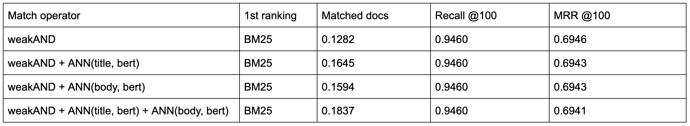
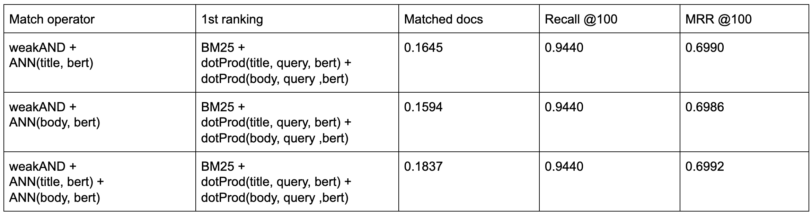
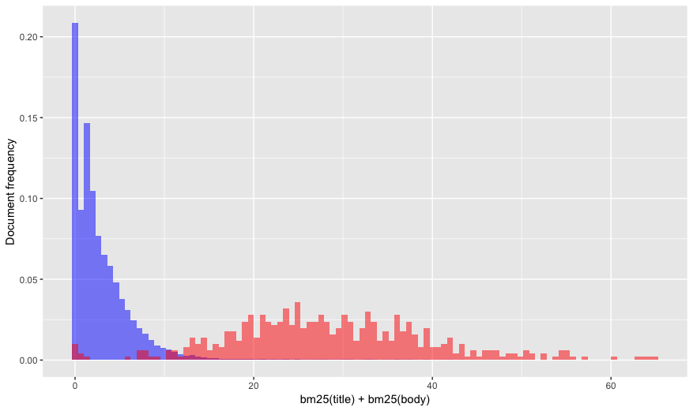
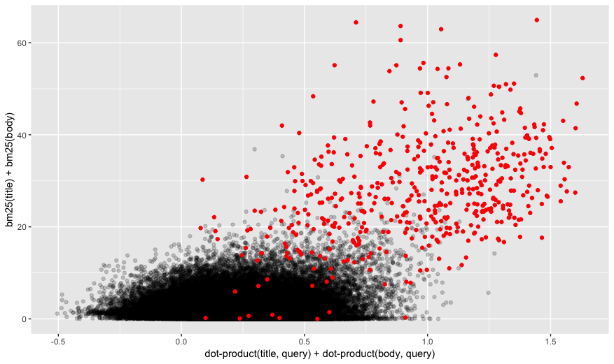

---
# Copyright 2019 Oath Inc. Licensed under the terms of the Apache 2.0 license. See LICENSE in the project root.
title: "Semantic Text Search: Quick start "
---

TODO: Work on introduction
*  The point here is to provide out of the box semantic search. Little or no fine-tuning.

## A note on the data

TODO: Data used ...

## A note on metrics

We will use three metrics on the experiments reported here. They are: 

1. Matched docs: The total number of documents matched by the query.
2. Recall @ 100: The number of relevant documents retrieved in the first 100 positions divided by the number of queries.
3. MRR @ 100: The mean reciprocal rank metric computed by the considering the first 100 documents returned by each query.

If we think about an end-to-end application we probably care the most about the `Matched docs` and `MRR @ 100`. The smaller the `Matched docs` the faster and cheaper is our application. The higher the `MRR @ 100` the better we are placing the relevant documents right at the top where we want them. 

However, assuming that we can deploy a multi-phased ranking system with cheaper 1st phase and more elaborate 2nd phase we will also focus here on the relationship between `Matched docs` and `Recall @ 100 and assume that we could come up with a more accurate 2nd phase that correlates well with the 1st phase being experimented.

## Baselines

Before we proceed to more elaborate experiments we need to establish some obvious baselines. Here are the results obtained by using query terms to match documents and [BM25](https://docs.vespa.ai/documentation/reference/bm25.html) as 1st phase ranking:

<div style="text-align:center"></div>

The match operator `AND` means that we are only maching documents that contain all the query terms either in the title or in the body of the document. A sample query looks like this:

```
{
	"yql":"select * from sources * where (userInput(@userQuery));"
	"userQuery":"what types of plate boundaries cause deep sea trenches"
	"ranking":{
		"profile":"bm25"
		"listFeatures":"true"
	}
	...
}
```

The match operator `OR` means that we are matching documents that contain any of the query terms either in the title or in the body. The only different is the inclusion of the `[{"grammar": "any"}]` in the [YQL](https://docs.vespa.ai/documentation/query-language.html) expression. 

```
{
	"yql":"select * from sources * where ([{"grammar": "any"}]userInput(@userQuery));"
	...
}
```

The baselines are two obvious choices that also represent to extremes that are interesting to analyse. The `AND` operator is too restrictive, matching very few documents. The consequence is that it end up missing the relavant documents in the first 100 position for approximately half of the queries. The `OR` operator on the other hand, match the majority of the documents in the corpus and recall the relevant document for most of the queries.

## Pre-trained vector embeddings

While performing the experiments reported here, we evaluated different types of pre-trained vectors, all public available. They were:
1. Word2Vec (avaialble via [TensorFlow Hub](https://tfhub.dev/google/Wiki-words-500-with-normalization/2))
2. Universal sentence encoder (avaialble via [TensorFlow Hub](https://tfhub.dev/google/universal-sentence-encoder/4))
3. Sentence BERT (available via the python [sentence-transformers library](https://github.com/UKPLab/sentence-transformers))

The approach used here was to create one vector for title and one vector for body for each document and to create one query vector for each query. It might not make sense to use large texts such as the body of the documents to create embedding vectors based on sentence models. However, testing how far we can go without tailoring the application too much is part of our experiment goals. In order words, how well can we create out of the box text application by adding semantic search cababilities for arbitrary chunks of text, with as little pre-processing as possible.

## From text to embeddings methodology

We also do not claim to have built query and document vectors in the most optimal way. However, we do think that we have followed what most people getting started in the NLP landscape would do given how repositories and libraries like tensorflow hub and sentence-transformers library are presented.

```
From tensorflow hub

import tensorflow as tf

embed = hub.load("https://tfhub.dev/google/universal-sentence-encoder/4")
embeddings = embed([
    "The quick brown fox jumps over the lazy dog.",
    "I am a sentence for which I would like to get its embedding"])

print embeddings
```

```
From sentence-transformers library

from sentence_transformers import SentenceTransformer
model = SentenceTransformer("bert-base-nli-mean-tokens")

sentences = ["This framework generates embeddings for each input sentence",
    "Sentences are passed as a list of string.", 
    "The quick brown fox jumps over the lazy dog."]
sentence_embeddings = model.encode(sentences)
```

## Approximate Nearest Neighbor (ANN) operator

Vespa can now match documents based on distance metrics between query and document vectors. This is a long awaited feature that will make it possible to implement strategies like semantic search at scale due to techniques such as Approximate Nearest Neighbor (ANN). Discussing ANN theory and implementation is beyond the scope of this tutorial. Instead we want to show how it can be used for semantic search.

There are only two steps required to perform ANN with embeddings in Vespa:
* Define the document embedding fields in the search definition file.
* Define the query embedding field in a query profile type.

Once that is done, we can feed document embeddings to Vespa, use the ANN operator to match documents based on the distance between document and query embeddings and use the embeddings in ranking functions.

### Query profile type

https://docs.vespa.ai/documentation/query-profiles.html#query-profile-types

```
<query-profile-type id="root">
  <field name="ranking.features.query(tensor_bert)" type="tensor&lt;float&gt;(x[768])" />
</query-profile-type>
```

### Search definition

```
field title_bert type tensor<float>(x[768]) {
    indexing: attribute
}

field body_bert type tensor<float>(x[768]) {
    indexing: attribute
}
```

```
rank-profile bert_title_body_all inherits default {
    function dot_product_title() {
        expression: sum(query(tensor_bert)*attribute(title_bert))
    }
    function dot_product_body() {
        expression: sum(query(tensor_bert)*attribute(body_bert))
    }
    first-phase {
        expression: dot_product_title() + dot_product_body()
    }
}
```

### ANN operator

```
{
	"yql":"select * from sources * where ([{"targetNumHits": 1000, "label": "nns"}]nearestNeighbor(title_bert, tensor_bert));"
	"userQuery":"what types of plate boundaries cause deep sea trenches"
	"ranking":{
		"profile":"bert_title_body_all"
		"listFeatures":"true"
	}
	"ranking.features.query(tensor_bert)":"[0.05121087115032622, -0.0035218095295999675, ..., 0.05303904445092506]"
	...
} 
```

## ANN results

The table below show results obtained by matching the closest 1.000 document vectors to the query vector in terms of the Euclidena distance. Even though we use the Vespa `ANN` operator, we set the method to be brute force to remove the approximation error from the analysis. This means that the documents matched were indeed the closest ones to the query. `ANN(title, bert)` means that we matched documents by comparing the document title embedding to the query embedding where the embeddings were created by the sentence BERT model. 

All the results involving embeddings in this tutorial are generated via the sentence BERT model. The results obtained with the Universal Sentence Encoder model were very similar and therefore omitted. On the other hand, the results obtained with the Word2Vec model were way worse than expected and were left out because they belong to a more post-mortem type of discussion.

<div style="text-align:center"></div>

In addition to matching documents based on the distance between document and query vectors, we also ranked the matched documents using the semantic vectors by having the 1st phase ranking function be the dot-product between query and title plus the dot-product between the query and body. All embedding vectors are normalized to have length (L2-norm) equal to 1.

The results obtained are promising with respect to the relationship between matched documents and recall. We retrieved only around 6% of the documents which is more than the `AND` operator but much less than the `OR` operator while we increased the recall from 48% (obtained with `AND`) to 75%, which is great although we still have a good way to go to reach 96% (obtained with the `OR`).

Since it is often mentioned that semantic search works better when combined with term-matching, it would be wise for us to check the metrics obtained when combining both. and semantic. But first, lets see some useful features related to term-matching that is available in Vespa.

* TODO: Including BM25 here in the 1st phase does not make sense due to the lack of query terms in the YQL
Similarly, I am excluding ANN(title, bert) + ANN(body, bert) since they retrieve all the documents

## weakAND operator and its effectiveness

The [weakAnd](https://docs.vespa.ai/documentation/using-wand-with-vespa.html) implementation scores documents by a simplified scoring function, which uses two core text rank features `term(n).significance` and `term(n).weight`.

Below is a query example that uses the `weakAND` operator with an annotation that set the target number of documents to be 1.000.

```
{
	"yql":"select * from sources * where ([{"targetNumHits": 1000}]weakAnd(default contains "what", default contains "types", default contains "of", default contains "plate", default contains "boundaries", default contains "cause", default contains "deep", default contains "sea", default contains "trenches"));"
	"userQuery":"what types of plate boundaries cause deep sea trenches"
	"ranking":{
		"profile":"bm25"
		"listFeatures":"true"
	}
	...
}
```

Remember that the `default` is the fieldset that included both the `title` and the `body` fields. 

```
fieldset default {
    fields: title, body
}
```

It was surprising to see the effectiveness of the WAND operator in this case: 

<div style="text-align:center"></div>

It matched much less documents than the `OR` operator (12.5% versus 85% respectvelly) while keeping a similar recall metric (92% versus 96% respectivelly). 

If you are detail oriented, you might be wondering why the `weakAND` operator matched 12.5% of the documents if we set `targetNumHits` to be 1.000. The reason for that is that the algorithm starts with a initial list of 1.000 candidates and start to add new ones that are best than the documents already in the list. That way the 1.000 ends up being the lower bound of the documents matched.

## ANN and weakAND: Little improvement

My second and perhaps more important surprise was how little the pre-trained sentence embeddings contributed in addition to what was delivered by WAND. 

<div style="text-align:center"></div>

You could argue that maybe the articles retrieved by ANN does not contain the query terms leading to zero BM25 scores, so we can add the (unscaled) dot-product in the 1st phase ranking

<div style="text-align:center"></div>

TODO: [MISSING: SCALE ONE CASE TO SEE IF THERE IS ANY IMPROVEMENTS ALSO CHECK DATA TO SEE IF THERE IS NO DISCONTINUITY IN THE DOT-PRODUCT VALUES]

## MSMARCO: A biased dataset?

We would of course expect a significant intersection between term-matching and semantic signals since both should contain information about query document relevance. However, the semantic signals need to complement the term-matching signals for it to be valuable, given that they are more expensive to store and compute. This means that they should match relevant documents that would not otherwise be matched by term-matching signals. 

The results discussed so far did not show any significant improvement by adding (pre-trained) semantic vectors in addition to the term-matching signals. The important question is why not? One possibility is to say that the pre-trained semantic vectors are not informative enough in this context. However, the graph below indicates otherwise. The blue histogram shows the empirical distribution of embedding dot-product scores for the general population of (query, document) pairs. The red histogram shows the empirical distribution of embedding dot-product scores for the population of (query, relevant_document) pairs. So the dot-product scores are significantly higher for documents relevant to the query than they are for random documents. 

<div style="text-align:center"></div>

This confirms the results we obtained when only using `ANN` operator to match the documents and the dot-product scores to rank them and shows that pre-trained embedding indeed carry relevant information about query document relevance. If that is the case, there is also the possibility that the dataset being used, MS MARCO dataset in our case, is biased towards term-matching signals. The next graph supports this hypotheses by showing that the empirical distribution of the relevant documents (red) is significantly higher in bm25 score than the distribution of a random documents.

<div style="text-align:center"></div>

In other words, there are very few documents that would not be matched by term-matching approaches. This explaing why the results obtained with the `weakAND` operator were outstanding. MS MARCO dataset turns out to be a favorable environement for this kind of algorithm. That also mean that after accounting for term-matching there are almost no relevant documents left to be matched by semantic signals. This is true even if the semantic embedding are informative. 

The best we can hope for in a biased dataset is for the bm25 scores and the embedding dot-product scores to be positive correlated, showing that both carry information about document relevance. This seems indeed to be the case in the scatter plot below that shows a much stronger correlation between bm25 scores and embedding scores for the relevant documents (red) than between the scores of the general population (black).

<div style="text-align:center"></div>

To be clear, there is no claim being made that the results and conclusions described here are valid across different NLP datasets and tasks. However, this problem might be more common than we would like to admit given the nature of how the datasets are created. For example, according to the [TODO: Add ref]MS MARCO paper, they built the dataset by:

1. Sampling queries from Bing’s search logs.
2. Filtering out non question queries.
3. Retrieve relevant documents for each question using Bing from its large-scale web index.
4. Automatically extract relevant passages from those documents
5. Human editos then annotate passages that contain useful and necessary information for answering the questions

Looking at steps 3 and 4 (and maybe 5), it is not surprising to find bias in the dataset and bias is indeed recognized as an issue in the literature. But it was a bit surprising to see the degree of the bias and how this might affect experiments involving semantic search.

## Fine-tuning sentence embeddings: advantages and disadvantages

At this point a common observation would be that we are talking about pre-trained embeddings and that we could get better results if we fine-tuned the embeddings to the specific application at hand. This might very well be the case but there are at least two important considerations to be taken into account, cost and overfitting. The resource/cost consideration is important but more obvious to be recognized. You either have the money to pursue it or not. If you do, you still should check to see if the improvement you get is worth the cost. 

The main issue in this case relates to overfitting. It is not easy to avoid overfitting when using big and complex models such as Universal Sentence Encoder and sentence BERT. Even if we use the entire MS MARCO dataset, which is considered a big and important recent developments to help advance the research around NLP tasks, we only have around 3 million documents and 300 thousand labeled queries to work with. This is not necessarily big relative to such massive models. 

Another important observation is that BERT-related architectures have dominated the [TODO: link] MSMARCO leaderboards for quite some time. Anna Rogers [wrote a good piece](https://hackingsemantics.xyz/2019/leaderboards/) about some of the challenges involved on the current trend of using leaderboards to measure model performance in NLP tasks. 

But despite all those remarks, the most important point here is that if we want to investigate to power and limitations of semantic vectors (pre-trained or not), we should ideally prioritize datasets that are less biased towards term-matching signals. 


<script>
function processFilePREs() {
    var tags = document.getElementsByTagName("pre");

    // copy elements, because the list above is mutated by the insert html below
    var elems = [];
    for (i = 0; i < tags.length; i++) {
        elems.push(tags[i]);
    }

    for (i = 0; i < elems.length; i++) {
        var elem = elems[i];
        if (elem.getAttribute("data-test") === "file") {
            var html = elem.innerHTML;
            elem.innerHTML = html.replace(/<!--\?/g, "<?").replace(/\?-->/g, "?>").replace(/</g, "&lt;").replace(/>/g, "&gt;");
            elem.insertAdjacentHTML("beforebegin", "<pre class=\"filepath\">file: " + elem.getAttribute("data-path") + "</pre>");
        }
    }
};

processFilePREs();

</script>
