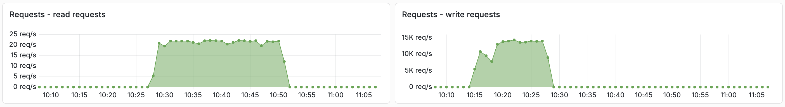

---
# Copyright Vespa.ai. All rights reserved.
title: "SPANN Billion Scale Vector Search"
---


The SPANN (Space Partitioned ANN) approach for approximate nearest neighbor search is described in
[SPANN: Highly-efficient Billion-scale Approximate Nearest Neighbor Search](https://arxiv.org/abs/2111.08566).
SPANN uses a hybrid combination of graph and inverted index methods for approximate nearest neighbor search.

We recommend you read [Billion-scale vector search using hybrid HNSW-IF](https://blog.vespa.ai/vespa-hybrid-billion-scale-vector-search/)
for details on how SPANN is implemented using Vespa, before running this example application.
Excerpt:

> SPANN searches for the k closest centroid vectors of the query vector in the in-memory ANN search data structure.
> Then, it reads the k associated posting lists for the retrieved centroids
> and computes the distance between the query vector and the vector data read from the posting list:


This sample application demonstrates how to represent SPANN using Vespa.




## Download Vector Data
This sample app uses the Microsoft SPACEV vector dataset from [big-ann-benchmarks.com](https://big-ann-benchmarks.com/).
It uses the first 10M vectors of the 100M slice sample.
This sample file is about 1GB (10M vectors):
<div class="pre-parent">
  <button class="d-icon d-duplicate pre-copy-button" onclick="copyPreContent(this)"></button>
<pre data-test="exec">
$ curl -L -o spacev10m_base.i8bin \
  https://data.vespa-cloud.com/sample-apps-data/spacev10m_base.i8bin
</pre>
</div>

Install dependencies and create the feed files for the first 10M vectors from the 100M sample:
<div class="pre-parent">
  <button class="d-icon d-duplicate pre-copy-button" onclick="copyPreContent(this)"></button>
<pre data-test="exec">
$ pip3 install numpy requests tqdm
</pre>
</div>
<div class="pre-parent">
  <button class="d-icon d-duplicate pre-copy-button" onclick="copyPreContent(this)"></button>
<pre data-test="exec">
$ python3 app/src/main/python/create-vespa-feed.py spacev10m_base.i8bin
</pre>
</div>
Output:
* `graph-vectors.jsonl`
* `if-vectors.jsonl`


## Build and deploy Vespa app
Build the application:
<div class="pre-parent">
  <button class="d-icon d-duplicate pre-copy-button" onclick="copyPreContent(this)"></button>
<pre data-test="exec" data-test-expect="BUILD SUCCESS" data-test-timeout="300">
$ mvn clean package -U -f app
</pre>
</div>

Deploy the application:
<div class="pre-parent">
  <button class="d-icon d-duplicate pre-copy-button" onclick="copyPreContent(this)"></button>
<pre data-test="exec" data-test-assert-contains="Success">
$ vespa deploy --wait 900 ./app
</pre>
</div>

Wait for the application endpoint to become available:
<div class="pre-parent">
  <button class="d-icon d-duplicate pre-copy-button" onclick="copyPreContent(this)"></button>
<pre data-test="exec" >
$ vespa status --wait 300
</pre>
</div>

Test [basic functionality](https://github.com/vespa-engine/sample-apps/blob/master/billion-scale-vector-search/app/src/test/application/tests/system-test/feed-and-search-test.json):
<div class="pre-parent">
  <button class="d-icon d-duplicate pre-copy-button" onclick="copyPreContent(this)"></button>
<pre data-test="exec" data-test-assert-contains="Success">
$ vespa test app/src/test/application/tests/system-test/feed-and-search-test.json
</pre>
</div>
See [CD tests](https://docs.vespa.ai/en/operations/automated-deployments.html#cd-tests) for details.

## Feed data
The _graph_ vectors must be feed before the _if_ vectors:
<div class="pre-parent">
  <button class="d-icon d-duplicate pre-copy-button" onclick="copyPreContent(this)"></button>
<pre data-test="exec">
$ vespa feed graph-vectors.jsonl
</pre>
</div>
<div class="pre-parent">
  <button class="d-icon d-duplicate pre-copy-button" onclick="copyPreContent(this)"></button>
<pre data-test="exec">
$ vespa feed if-vectors.jsonl
</pre>
</div>

Now is a good time to open the
[Vespa Cloud Dashboard](https://console.vespa-cloud.com/link/application/autotest/dev/instance/default?default.dev.aws-us-east-1c=metrics)
to track progress.

Refer to [&lt;resources&gt;](https://github.com/vespa-engine/sample-apps/blob/master/billion-scale-vector-search/app/src/main/application/services.xml)
configuration to manage the feeding speed - more CPU is better, e.g.:
```
<resources vcpu="8" memory="16Gb" disk="50Gb"/>
```
Use the [instance type reference](https://cloud.vespa.ai/en/reference/aws-flavors.html) to find good combinations.
Run time for a 2 VCPU deployment vs. 8 VCPU:


Observe the feed and query phases (below) of this guide:




## Recall Evaluation
Download the query vectors and the ground truth for the 10M first vectors:
<div class="pre-parent">
  <button class="d-icon d-duplicate pre-copy-button" onclick="copyPreContent(this)"></button>
<pre data-test="exec">
$ curl -L -o query.i8bin \
  https://github.com/microsoft/SPTAG/raw/main/datasets/SPACEV1B/query.bin
$ curl -L -o spacev10m_gt100.i8bin \
  https://data.vespa-cloud.com/sample-apps-data/spacev10m_gt100.i8bin
</pre>
</div>

<!--
Run first 1K queries and evaluate recall@10. A higher number of clusters gives higher recall:
<pre>
$ python3 app/src/main/python/recall.py --endpoint http://localhost:8080/search/ \
  --query_file query.i8bin \
  --query_gt_file spacev10m_gt100.i8bin  --clusters 12 --queries 1000
</pre>
-->

Find the path to the credentials from the `vespa auth cert` step above, like
<pre>
/Users/username/.vespa/tenant_name.autotest.default/data-plane-public-cert.pem
</pre>
Replace the two filenames in the command below.
(This is not needed when running a [local test](#local-test-with-oci-image))

Run first 1K queries and evaluate recall@10. A higher number of clusters gives higher recall:
<div class="pre-parent">
  <button class="d-icon d-duplicate pre-copy-button" onclick="copyPreContent(this)"></button>
<pre data-test="exec">
$ ENDPOINT=$(vespa status --format=plain)
$ python3 app/src/main/python/recall.py \
  --endpoint ${ENDPOINT}/search/ \
  --query_file query.i8bin \
  --query_gt_file spacev10m_gt100.i8bin \
  --certificate $PWD/../.vespa/vespa-team.autotest.default/data-plane-public-cert.pem \
  --key         $PWD/../.vespa/vespa-team.autotest.default/data-plane-private-key.pem
</pre>
</div>

See the [blog post](https://blog.vespa.ai/vespa-hybrid-billion-scale-vector-search/#hnsw-if-accuracy)
for details about this script.

<pre data-test="after" style="display:none">
$ vespa destroy --force
</pre>


## Local test with OCI image




Verify memory Limits:
<div class="pre-parent">
  <button class="d-icon d-duplicate pre-copy-button" onclick="copyPreContent(this)"></button>
<pre>
$ docker info | grep "Total Memory"
</pre>
or
</div>
<div class="pre-parent">
  <button class="d-icon d-duplicate pre-copy-button" onclick="copyPreContent(this)"></button>
<pre>
$ podman info | grep "memTotal"
</pre>
</div>

Install [Vespa CLI](../clients/vespa-cli.html):
<div class="pre-parent">
  <button class="d-icon d-duplicate pre-copy-button" onclick="copyPreContent(this)"></button>
<pre>
$ brew install vespa-cli
</pre>
</div>

For local deployment:
<div class="pre-parent">
  <button class="d-icon d-duplicate pre-copy-button" onclick="copyPreContent(this)"></button>
<pre>
$ vespa config set target local
</pre>
</div>

Download this sample application:
<div class="pre-parent">
  <button class="d-icon d-duplicate pre-copy-button" onclick="copyPreContent(this)"></button>
<pre>
$ vespa clone billion-scale-vector-search myapp && cd myapp
</pre>
</div>

Pull and start the Vespa image:
<div class="pre-parent">
  <button class="d-icon d-duplicate pre-copy-button" onclick="copyPreContent(this)"></button>
<pre>
$ docker pull vespaengine/vespa
$ docker run --detach --name vespa --hostname vespa-container \
  --publish 127.0.0.1:8080:8080 --publish 127.0.0.1:19071:19071 \
  vespaengine/vespa
</pre>
</div>

Verify that the configuration service (deploy api) is ready:
<div class="pre-parent">
  <button class="d-icon d-duplicate pre-copy-button" onclick="copyPreContent(this)"></button>
<pre>
$ vespa status deploy --wait 300
</pre>
</div>

At this point, you can continue the guide from [download vector data](#download-vector-data).

----

### Cleanup
When done, remove the container:
<div class="pre-parent">
  <button class="d-icon d-duplicate pre-copy-button" onclick="copyPreContent(this)"></button>
<pre>
$ docker rm -f vespa
</pre>
</div>
