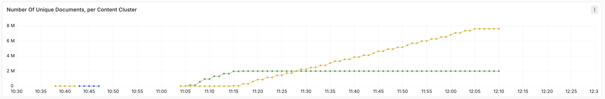
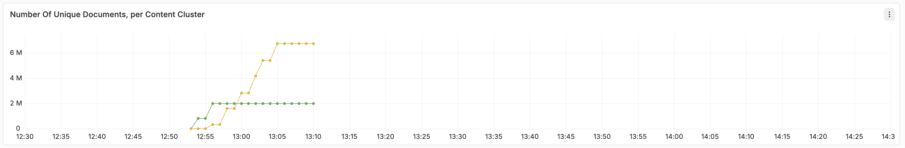

---
# Copyright Vespa.ai. All rights reserved.
title: "SPANN Billion Scale Vector Search"
---

This sample application demonstrates how to represent *SPANN* (Space Partitioned ANN) using Vespa.
The *SPANN* approach for approximate nearest neighbor search is described in
[SPANN: Highly-efficient Billion-scale Approximate Nearest Neighbor Search](https://arxiv.org/abs/2111.08566).

SPANN uses a hybrid combination of graph and inverted index methods for approximate nearest neighbor search.
See [Billion-scale vector search using hybrid HNSW-IF](https://blog.vespa.ai/vespa-hybrid-billion-scale-vector-search/)
for details on how SPANN is represented with Vespa.
These reproducing steps demonstrates the functionality using a smaller subset of the 1B vector dataset.




## Download Vector Data
This sample app uses the Microsoft SPACEV vector dataset from [big-ann-benchmarks.com](https://big-ann-benchmarks.com/).
It uses the first 10M vectors of the 100M slice sample.
This sample file is about 1GB (10M vectors):
<pre data-test="exec">
$ curl -L -o spacev10m_base.i8bin \
  https://data.vespa-cloud.com/sample-apps-data/spacev10m_base.i8bin
</pre>

Generate the feed file for the first 10M vectors from the 100M sample.
This step creates two feed files:

* `graph-vectors.jsonl`
* `if-vectors.jsonl`

Install dependencies and create the feed data:
<pre data-test="exec">
$ pip3 install numpy requests tqdm
</pre>
<pre data-test="exec">
$ python3 app/src/main/python/create-vespa-feed.py spacev10m_base.i8bin
</pre>


## Build and deploy Vespa app
Build the application:
<pre data-test="exec" data-test-expect="BUILD SUCCESS" data-test-timeout="300">
$ mvn clean package -U -f app
</pre>

Deploy the application:
<pre data-test="exec" data-test-assert-contains="Success">
$ vespa deploy --wait 900 ./app
</pre>

Wait for the application endpoint to become available:
<pre>
$ vespa status --wait 300
</pre>

Test basic functionality:
<pre data-test="exec" data-test-assert-contains="Success">
$ vespa test app/src/test/application/tests/system-test/feed-and-search-test.json
</pre>

The _graph_ vectors must be feed before the _if_ vectors:
<pre data-test="exec">
$ vespa feed graph-vectors.jsonl
$ vespa feed if-vectors.jsonl
</pre>

Now is a good time to open the Vespa Cloud Dashboard to track progress:
[metrics](https://console.vespa-cloud.com/link/application/autotest/dev/instance/default?default.dev.aws-us-east-1c=metrics)
Refer to [&lt;resources&gt;](https://github.com/vespa-engine/sample-apps/blob/master/billion-scale-vector-search/app/src/main/application/services.xml)
configuration to manage the feeding speed - more CPU is better, e.g.:
```
<resources vcpu="8" memory="16Gb" disk="50Gb"/>
```
Use the [instance type reference](https://cloud.vespa.ai/en/reference/aws-flavors.html) to find good combinations.
Run time for a 2 VCPU deployment vs. 8 VCPU:





## Recall Evaluation
Download the query vectors and the ground truth for the 10M first vectors:
<pre data-test="exec">
$ curl -L -o query.i8bin \
  https://github.com/microsoft/SPTAG/raw/main/datasets/SPACEV1B/query.bin
$ curl -L -o spacev10m_gt100.i8bin \
  https://data.vespa-cloud.com/sample-apps-data/spacev10m_gt100.i8bin
</pre>

<!--
Run first 1K queries and evaluate recall@10. A higher number of clusters gives higher recall:
<pre>
$ python3 app/src/main/python/recall.py --endpoint http://localhost:8080/search/ \
  --query_file query.i8bin \
  --query_gt_file spacev10m_gt100.i8bin  --clusters 12 --queries 1000
</pre>
-->

Run first 1K queries and evaluate recall@10. A higher number of clusters gives higher recall.
To evaluate recall using a deployment in Vespa Cloud dev zone,
the data plane certificate and key need to be provided, remember to replace with your tenant name in the paths:
<pre data-test="exec">
$ ENDPOINT=$(vespa status --format=plain)
$ python3 app/src/main/python/recall.py \
  --endpoint ${ENDPOINT}search/ \
  --query_file query.i8bin \
  --query_gt_file spacev10m_gt100.i8bin \
  --certificate $PWD/../.vespa/vespa-team.autotest.default/data-plane-public-cert.pem \
  --key         $PWD/../.vespa/vespa-team.autotest.default/data-plane-private-key.pem
</pre>


## Local test with OCI image




Verify Docker Memory Limits:
<pre>
$ docker info | grep "Total Memory"
or
$ podman info | grep "memTotal"
</pre>

Install [Vespa CLI](../clients/vespa-cli.html):
<pre>
$ brew install vespa-cli
</pre>

For local deployment using docker image use:
<pre>
$ vespa config set target local
</pre>

<pre>
$ git clone --depth 1 https://github.com/vespa-engine/sample-apps.git
$ cd sample-apps/billion-scale-vector-search
</pre>

Pull and start the vespa docker container image:
<pre>
$ docker pull vespaengine/vespa
$ docker run --detach --name vespa --hostname vespa-container \
  --publish 127.0.0.1:8080:8080 --publish 127.0.0.1:19071:19071 \
  vespaengine/vespa
</pre>

Verify that the configuration service (deploy api) is ready:
<pre>
$ vespa status deploy --wait 300
</pre>

Download this sample application:
<pre>
$ vespa clone billion-scale-vector-search myapp && cd myapp
</pre>


## Shutdown and remove the Docker container:
<pre>
$ docker rm -f vespa
</pre>

<pre data-test="after" style="display:none">
$ vespa destroy --force
</pre>
