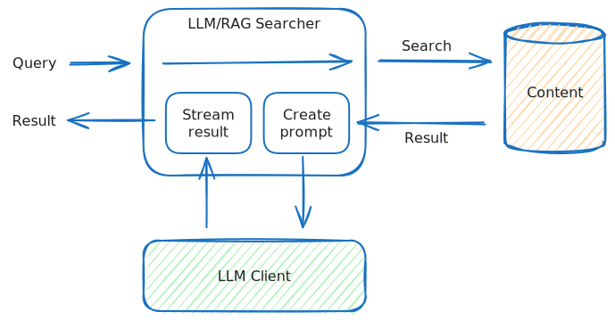

---
# Copyright Vespa.ai. All rights reserved.
title: "Large Language Models in Vespa"
---

Large Language Models (LLMs) are AI systems that generate human-like text,
supporting a variety of applications like chatbots and content generation. In
Vespa, LLMs can enhance search relevance, create dynamic content based on search
results, and understand natural language by integrating into Vespa's processing
chain structure, which handles querying and data ingestion. This allows Vespa to
apply LLMs' deep linguistic and semantic capabilities across different stages,
improving tasks from query comprehension to summarization and response
generation.

Vespa is ideally suited for retrieval-augmented generation (RAG). This technique
allows these models to access relevant and up-to-date information beyond their
training in real-time, enabling Vespa's output to be contextually informed. For
more information, refer to [Retrieval-Augmented Generation in Vespa](llms-rag.html).

The advantage of setting up a client connection to an LLM from within your Vespa application compared to doing the API call(s) from your client after responses are returned from Vespa is that you eliminate an extra network hop, which means lower latency for end users.
The importance of this is amplified if you want to leverage multiple LLM calls for eg. agentic applications or reranking.

Vespa supports LLMs in two ways:

1. [**External LLMs**](llms-external.html): Vespa can connect to any external LLM providers that serves an <a href="https://platform.openai.com/docs/guides/text-generation/chat-completions-api" data-proofer-ignore>OpenAI-compatible API</a>.
.
2. [**Local LLMs**](llms-local.html): Vespa can run LLMs within the Vespa application itself. This allows for customized models and avoids sending data outside  the application. This is particularly useful for applications with strict data privacy requirements or those needing specific model configurations.

This document will focus on features that are common to both external and local LLMs. For more information on configuration details for each type, please refer to the respective sections.

For a quick start, check out the
<a href="https://github.com/vespa-engine/sample-apps/tree/master/retrieval-augmented-generation" data-proofer-ignore>RAG sample app</a>
which demonstrates setting up Vespa for RAG, using either an external LLM service or a local LLM.

### Using LLMs



Vespa distinguishes between the clients used to connect to LLMs and components that uses these
clients. You can, for instance, set up a single client connection to an LLM, and use this connection for both [document enrichment](TODO) and retrieval-augmented generation (RAG).



After adding a client connection to your `services.xml`, you can use the same client for various
tasks such as retrieval-augmented generation. To do this, you need to set up the
searchers or document processors that will use them. An example of a simple
searcher that uses the client component is the `LLMSearcher`, which can be set
up like this:

```
<services version="1.0">
  <container id="default" version="1.0">

    ...

    <component id="openai" class="ai.vespa.llm.clients.OpenAI">
      <!-- Configure as required -->
    </component>

    <search>
      <chain id="llm" inherits="vespa">
        <searcher id="ai.vespa.search.llm.LLMSearcher">
          <config name="ai.vespa.search.llm.llm-searcher">
            <providerId>openai</providerId>
          </config>
        </searcher>
      </chain>
    </search>

    ...

  </container>
</services>
```

This sets up a new [search chain](reference/services-search.html#chain) which
includes an `LLMSearcher`. This searcher has the responsibility of calling out to
the LLM connection using some prompt that has been sent along with the query.

Note the `providerId` configuration parameter: this must match the `id` given in
the component specification. Using this, one can set up as many clients and
searchers and combinations of these as one needs. If you do not specify a
`providerId`, the searcher will use the first available LLM connection.

This particular searcher doesn't provide a lot of functionality, it only calls
out to the LLM service using a provided prompt sent along with the query. The
searcher expects the prompt to be passed in the query parameter `prompt`. For
instance, using the Vespa CLI:

```
$ vespa query \
    --header="X-LLM-API-KEY:..." \
    searchChain=llm \
    prompt="what was the manhattan project?"
```

Here, we first pass along the API key to the OpenAI API. You need to provide your
own OpenAI key for this. The `searchChain` parameter selects the `llm` chain set
up in `services.xml`. Finally, the `prompt` parameter determines what is sent to
the language model.

Note that if the `prompt` query parameter is not provided, the `LLMSearcher` will
try to use the `query` query parameter.

By running the above command you will get something like the following:

```
{
 "root": {
   "id": "token_stream",
   "relevance": 1.0,
   "fields": {
     "totalCount": 0
   },
   "children": [
     {
       "id": "event_stream",
       "relevance": 1.0,
       "children": [
         {
           "id": "1",
           "relevance": 1.0,
           "fields": {
             "token": "The"
           }
         },
         {
           "id": "2",
           "relevance": 1.0,
           "fields": {
             "token": " Manhattan"
           }
         },
         {
           "id": "3",
           "relevance": 1.0,
           "fields": {
             "token": " Project"
           }
         },
         {
           "id": "4",
           "relevance": 1.0,
           "fields": {
             "token": " was"
           }
         },
         ...
    ]
  }
}
```

### Streaming with Server-Sent Events

By running the above, you will have to wait until the entire response is
generated from the underlying LLM. This can take a while, as LLMs generate one
token at a time. To stream the tokens as they arrive, use the `sse` (Server-Sent
Events) renderer by adding the `format` query parameter:

```
$ vespa query \
    --header="X-LLM-API-KEY:..." \
    searchChain=llm \
    prompt="what was the manhattan project?" \
    format=sse

The Manhattan Project was a research and development project during World War II that produced the first nuclear weapons. It was led by the United States with the support of the United Kingdom and Canada, and aimed to develop the technology necessary to build an atomic bomb. The project culminated in the bombings of the Japanese cities of Hiroshima and Nagasaki in August 1945.
```

The Vespa CLI understands this format and will stream the tokens as they arrive.
The underlying format is [Server-Sent
Events](https://html.spec.whatwg.org/multipage/server-sent-events.html), and the
output from Vespa is like this:

```
$ vespa query \
    --format=plain \
    --header="X-LLM-API-KEY:..." \
    searchChain=llm \
    prompt="what was the manhattan project?" \
    format=sse

event: token
data: {"token":"The"}

event: token
data: {"token":" Manhattan"}

event: token
data: {"token":" Project"}

event: token
data: {"token":" was"}

event: token
data: {"token":" a"}

...
```

Notice the use of the `--format=plain` in the Vespa CLI here to output exactly
what is sent from Vespa.

These events can be consumed by using a `EventSource` as described in the [HTML
specification](https://html.spec.whatwg.org/multipage/server-sent-events.html#server-sent-events),
or however you see fit as the format is fairly simple. Each `data` element
contains a small JSON object which must be parsed, and contains a single `token`
element containing the actual token.

Errors are also sent in such events:

```
$ vespa query \
    --header="X-LLM-API-KEY: banana" \
    prompt="what was the manhattan project?" \
    searchChain=llm \
    format=sse

event: error
data: {
    "source": "openai",
    "error": 401,
    "message": "{    \"error\": {        \"message\": \"Incorrect API key provided: banana. You can find your API key at https://platform.openai.com/account/api-keys.\",        \"type\": \"invalid_request_error\",        \"param\": null,        \"code\": \"invalid_api_key\"    }}"
}
```

### LLM parameters

The LLM service typically has a set of inference parameters that can be set. This can
be parameters such as:

- `model` - for OpenAI can be any valid model such as `gpt-4o` or `gpt-4o-mini` etc.
- `temperature` - for setting the model temperature
- `maxTokens` - for setting the maximum number of tokens to produce

Note that these parameters are common to both [Local LLMs](/en/llms-local.html) and [External LLMs](/en/llms-external.html), but each of them also supports additional inference parameters. See the respective sections for more details on these.

To provide inference parameters, you pass these along with the query:

```
$ vespa query \
    --header="X-LLM-API-KEY: ..." \
    prompt="what was the manhattan project?" \
    searchChain=llm \
    format=sse \
    llm.model=gpt-4 \
    llm.maxTokens=10
```

Note that these parameters are prepended with `llm`. This is so that you can
have multiple LLM searchers and control them independently by setting them up
with different property prefixes in `services.xml`. For instance:

```
<chain id="rag" inherits="vespa">
  <searcher id="ai.vespa.search.llm.RAGSearcher">
    <config name="ai.vespa.search.llm.llm-searcher">
      <providerId>openai</providerId>
      <propertyPrefix>rag</propertyPrefix>
    </config>
  </searcher>
  <searcher id="ai.vespa.search.llm.LLMSearcher">
    <config name="ai.vespa.search.llm.llm-searcher">
      <providerId>openai</providerId>
      <propertyPrefix>llm</propertyPrefix>
    </config>
  </searcher>
</chain>
```

Here, we have set up a chain with two LLM searchers, that have set up different
`propertyPrefix`s. The searchers use this to get their specific properties. This
also includes prompts. The prompt for the first searcher would thus be
`rag.prompt` and the second would be `llm.prompt`.

Note that if this `propertyPrefix` is not set, the default is `llm` and all LLM
searchers would share the same parameters.

Also note that `prompt` does not need to be prefixed in the query, however the
other parameters do need to.

If you are using different LLM services, you can also distinguish between API
keys sent along with the query by prepending them as well with the
`propertyPrefix`.

### Retrieval-Augmented Generation (RAG)

Above we used the `LLMSearcher` to call out to LLMs using a pre-specified
prompt. Vespa provides the `RAGSearcher` to construct a prompt based on search
results. This enables a flexible way of first searching for content in Vespa,
and using the results to generate a response.

Please refer to [RAG in Vespa](llms-rag.html) for more details.

### Structured output

Both the `OpenAI` and  `LocalLLM` clients in Vespa can also be configured to return [structured output](https://platform.openai.com/docs/guides/structured-outputs). This is done by providing an `llm.json_schema` in the query. (Assuming you are using the `LLMSearcher` or `RAGSearcher` with `propertyPrefix=llm`).

This can be useful for different use cases.
Examples include applying moderation of the output or providing the response in different styles and/or languages.

```json
{
    "type": "object",
    "properties": {
        "answer-short": {
            "type": "string"
        },
        "answer-short-french": {
            "type": "string",
            "description": "exact translation of short answer in French language"
        },
        "answer-short-eli5": {
            "type": "string",
            "description": "explain the answer like I am 5 years old"
        }
    },
    "required": [
        "answer-short",
        "answer-short-french",
        "answer-short-eli5"
    ],
    "additionalProperties": false
}
```

The `json_schema` can be passed with the query using the `llm.json_schema` parameter:

```
$ vespa query \
    --timeout 60 \
    --header="X-LLM-API-KEY:<YOUR_API_KEY>" \
    query="what was the manhattan project?" \
    hits=5 \
    searchChain=openai \
    format=sse \
    llm.json_schema="{\"type\":\"object\",\"properties\":{\"answer-short\":{\"type\":\"string\"},\"answer-short-french\":{\"type\":\"string\",\"description\":\"exact translation of short answer in French language\"},\"answer-short-eli5\":{\"type\":\"string\",\"description\":\"explain the answer like I am 5 years old\"}},\"required\":[\"answer-short\",\"answer-short-french\",\"answer-short-eli5\"],\"additionalProperties\":false}" \
    traceLevel=1
```

Which for example, using `gpt-4o-mini` returns
```json
{
    "answer-short": "The Manhattan Project was a World War II research and development program that produced the first atomic bombs, led by the United States with help from the UK and Canada, overseen by Major General Leslie Groves and physicist Robert Oppenheimer.",
    "answer-short-french": "Le Projet Manhattan était un programme de recherche et développement de la Seconde Guerre mondiale qui a produit les premières bombes atomiques, dirigé par les États-Unis avec l'aide du Royaume-Uni et du Canada, sous la supervision du général Leslie Groves et du physicien Robert Oppenheimer.",
    "answer-short-eli5": "The Manhattan Project was a secret and important project during World War II where scientists worked together to make the first big bombs that could make huge explosions, which changed the world."
}
```

This can also leveraged for automated [Document Enrichment](TODO) during ingestion. With this approach, the `json_schema` is automatically generated based on the Vespa schema (and your prompt).

### Query profiles

In all the above you have sent parameters along with each query. It is worth
mentioning that Vespa supports [query profiles](query-profiles.html), which are
named collections of search parameters. This frees the client from having to
manage and send a large number of parameters, and enables the request parameters
for a use case to be changed without having to change the client.

### Creating your own searchers in Java

The above example uses the `LLMSearcher`
[class](https://github.com/vespa-engine/vespa/blob/master/container-search/src/main/java/ai/vespa/search/llm/LLMSearcher.java).
You can easily create your own LLM searcher in Java by either specifically
[injecting](jdisc/injecting-components.html) the connection component, or
subclassing the `LLMSearcher`. Please refer to [Searcher Development](searcher-development.html) or [Document Processor Development](document-processing.html) for more information on creating your own components.

Note that it should not be necessary to create your own components in Java to
use this functionality.
