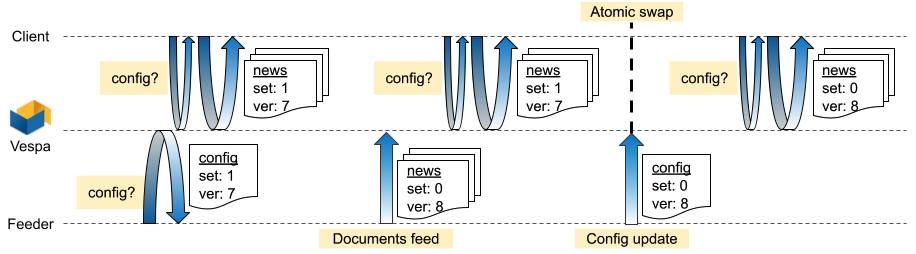
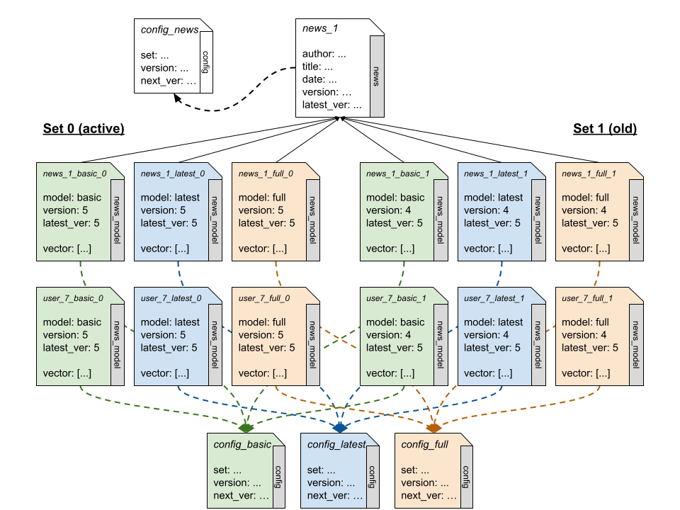

---
# Copyright Verizon Media. Licensed under the terms of the Apache 2.0 license. See LICENSE in the project root.
title: "News Recommendation Tutorial - models hot-swap"
---

## Introduction

This is the tenth part of the tutorial series for setting up a Vespa
application for personalized news recommendations. The parts are:  

1. [Getting started](news-1-getting-started.html)
2. [A basic news search application](news-2-basic-feeding-and-query.html) - application packages, feeding, query
3. [News search](news-3-searching.html) - sorting, grouping, and ranking
4. [Generating embeddings for users and news articles](news-4-embeddings.html)
5. [News recommendation](news-5-recommendation.html) - partial updates (news embeddings), ANNs, filtering
6. [News recommendation with searchers](news-6-recommendation-with-searchers.html) - custom searchers, doc processors
7. [News recommendation with parent-child](news-7-recommendation-with-parent-child.html) - parent-child, tensor ranking
8. Advanced news recommendation - intermission - training a ranking model
9. Advanced news recommendation - ML models
10. [Models hot-swap](news-10-models-hot-swap.html) - atomic model updates

This episode of the new recommendations tutorial describes ways to manage a real-world Vespa application, which is updated on a regular basis while users are performing searches (hot swap). It also extends the application to support multiple models while minimizing the amount of data duplication. Lastly, it demonstrates an efficient garbage collection mechanism, removing obsolete data from the application.

In the previous episodes of the news recommendation tutorial, we've created a Vespa application that recommends news articles to a given user. Recommendations are based on a model that contains two sets of embeddings - user and news. To obtain the recommendation, the given user's embeddings should first be obtained, and then the news whose embeddings are closest to the user's should be searched for. The closest news articles are the most relevant to that user.

This series started with an introduction to the basic Vespa capabilities, proceeded to describe model-based recommendations, and moved to more advanced models relying on neural networks. This post is unrelated to the model generation and ranking specifications, hence for simplicity just assumes embeddings are available along with some ranking function.

## Real-world requirements

Moving from a demo app to a real-world one adds several requirements that must be supported:

1. **Hot swap** - models should be updated on a regular basis, as new users and news articles enter the system, and more events (users viewing and clicking news) are collected. Model updates must be atomic from the users perspective, namely a ranking procedure must not consider embeddings from different models. Further, there must be no downtime for model updates.
2. **Multiple models** - our initial model recommends news articles to users based on other users' interactions with those articles (as well as categories and content). This is the basic model. Now, let us consider two other (somewhat contrived) models: _recent_, which only considers events from the last day, and _fully-read_, which only considers articles in which the user has scrolled all the way down. While all 3 models contain the same users and articles, and all rely on the same model generation procedure, each model is composed of a completely different set of embeddings.
3. **Shared model-agnostic data** - news articles carry data and metadata that can be used for filtering - title, author, category, language, and so on. These fields should better not be replicated across the per-model documents. Further, while the models rely on user events coming from some tracking system, the model-agnostic fields may come from some database. Decoupling operations relying on each data source can eliminate coordination issues.
4. **Cleanup** - news articles might be deleted and users might opt out of the system. Our system should not rely on or recommend stale data, hence obsolete entities should be removed. Assuming news articles and users aren't deleted from Vespa in real time, we need a way to remove the obsolete users and articles from the application.

Luckily, Vespa provides useful building blocks to handle these real-world requirements. While the requirements might seem mostly independent, we shall see how certain Vespa features can be reused in order to address multiple requirements.

## Hot swap

The central requirement for hot swap is atomicity: an ongoing query should always see embeddings belonging to a single model, regardless of whether new documents are being fed to the app. Since Vespa doesn't support transactional feeding, it is up to the application to implement the transactions. The weapon of choice - versioning:

1. **External versioning** - a version number is appended to each document ID, forming different document sets. This separates the documents belonging to the current model from the documents belonging to the next (or previous) model, allowing them to coexist without overwriting each other. External versions can alternate between 0 and 1, without going further. This way, a new model will (mostly) overwrite the documents of the previous model, which is already obsolete.
2. **Internal versioning** - a version number is stored inside each document belonging to the model. This model number will be increased in every feeding, allowing queries to only target the current model, filtering our documents belonging to the next or previous one.

Versioning can be stored in a database or some configuration file, but the simplest place is probably the Vespa app itself, using a dedicated type:
```
search config {
    document config {

        field set type int {
            indexing: summary | attribute
        }
        field version type long {
            indexing: summary | attribute
        }
   }
}
```

Versioning is used as depicted below. The client running recommendation queries starts by obtaining the configuration of the target model. It then adds a filter clause to the following query, limiting it to the current internal version. On the feeding side, the configuration is also read first. Documents are then generated such that they have the next internal version and the alternative set. Once all documents are fed successfully, the configuration document is updated with the new internal version and set. From that point onward, any new search will target the newly fed model.



## Supporting multiple models

As said, we'd like our app to support multiple recommendation models - basic, recent news and only fully read articles, for instance. To separate those models, who all share the same news article and user schemas, we can use a dedicated model code: (1) in the document ID, to avoid documents from different models from overriding each other, and (2) inside the document, to allow us to filter out documents from other models in our queries.

Since we're already storing an internal version in each model, it sounds reasonable to combine the version with the model code. However, as we'll soon see, we also use the internal version for garbage collection, so keeping the version and model apart simplifies other tasks.

The following fields will thus be added to the news and user schemas:
```
schema news {
    document news {

        # ... previously described fields ...

        field model type string {
            indexing: index | attribute
        }
        field version type long {
            indexing: attribute
            attribute: fast-search
        }
    }
}
```

Each model is generated using a different dataset, hence it makes sense to separate the feeding procedures of each model. Consequently, each model should also have a separate configuration holding (possibly) different inner versions and sets.

## Managing model-agnostic data using parent documents

According to what we've described so far, each document will have 6 instances at any given moment - 3 different models * 2 sets. Most of the news article data is model agnostic, hence a single instance of that data can be used by all models. Further, the events used to create the prediction models (basically `<user ID, news ID, date, fully_read>` tuples or so) come from a different source than the news article data, hence processing and feeding them separately is advantageous.

In order to have all document instances share data, let us use Vespa's parent-child relations, also described in [part 7](news-7-recommendation-with-parent-child.html) of this series. Namely, let us extract model-related fields into a new schema called `news_model`, leave all other fields in `news`, and add a reference from the model docs to the shared docs. This reference will allow us to import fields from the parent (shared) doc to the child (model) doc, making them searchable and retrievable as if they were part of the model doc. The `news_model` schema should look as follows:

```
schema news_model {
    document news_model {

        field embedding type tensor<float>(d0[51]) {
            indexing: attribute
            attribute {
                distance-metric: euclidean
            }
        }
        field model type string {
            indexing: index | attribute
        }
        field version type long {
            indexing: attribute
            attribute: fast-search
        }

        field news_ref type reference<news> {
            indexing: attribute
        }
    }
    import field news_ref.title as title {}
    import field news_ref.language as language {}
}
```

The shared `news` schema should neither hold the model vector nor have a model field. However, it should still have a version field, obtained from a dedicated `news` configuration. This version will only be used for garbage collection, as described below.

## Garbage collection

After adding all the machinery above, time to make sure we keep our app clean and tidy. Recall that we keep two sets per model, such that version 1 goes to set 1, version 2 goes to set 0, version 3 goes to set 1, and so on. Now, let us assume that a certain news article was deleted by its author before version 3 was created. After feeding version 3, set 1 will include up-to-date articles with version 3, and the deleted article with version 1. While our queries filter by version hence will ignore the deleted article, we still need to remove it from the app, otherwise we'll gather a lot of obsolete data over time.

Vespa provides a built-in [garbage collection](../services-content.html#documents) mechanism, which relies on a filter that determines which documents should be included in the app, and consequently which documents should be removed from it. In our case, we detect up-to-date documents based on their internal version. Unfortunately, the filter expression is specified in the application settings, while the actual versions of interest change with each feeding. How can we filter out obsolete documents then?

To solve this problem, we leverage parent-child relations again. This time, each document forms this relation with its model configuration document and imports the `version` field, renaming it to `latest_version` for instance. Each document then has two version fields: the one with which it was created, and the one imported from the configuration. While the former is fixed and will never change, the latter will change any time the configuration is updated (imported fields are references, they don't hold the actual data). The relevant portions of the `user` and `news` schemas will now look as follows:

```
        field version type long {
            indexing: attribute
            attribute: fast-search
        }

        field config_ref type reference<config> {
            indexing: attribute
        }

        import field config_ref.version as latest_version {}
```

Now, we can distinguish between up-to-date and obsolete documents by comparing the `version` and `latest_version` fields: if they are equal the document is part of the latest feed, otherwise it wasn't. Note that a difference may be briefly acceptable during a hot swap, where on-going queries should access documents from the set that became old. We can therefore allow some slack in our filter definition, defined in `services.xml` under the `<content>` tag:
```
    <documents garbage-collection="true" garbage-collection-interval="21600">
      <document mode='index' type='config' global='true'/>
      <document mode='index' type='news' global='true' selection=
               '(news.latest_version == null) or
               (news.version >= news.latest_version - 2)'/>
      <document mode='index' type='news_model' selection=
               '(news_model.latest_version == null) or
               (news_model.version >= news_model.latest_version - 2)'/>
      <document mode='index' type='user' selection=
               '(user.latest_version == null) or
               (user.version >= user.latest_version - 2)'/>
    </documents>
```

Note that the filter not only contains comparing the internal and the latest version but also a check whether the latest version is `null`. This is required as the filter is also applied during feeding. At that point, the reference to the configuration document isn't active yet, hence all imported fields will contain `null` values. Without the `null` check, all our documents will be filtered out during feeding.

## Dealing with feeding failures

Consider the following scenario: your automated feeding workflow starts by obtaining the target version for the next feeding from the configuration, then feeds the vespa app, but then some failure happens before the hot swap is completed. Since the configuration wasn't updated, no query will consider the documents that were just fed. No harm done, right? Well, the next day, the feeding workflow starts again, with the next day's model. During the day that passed, some users and articles were removed from the system, hence aren't included in the new model. The feeding completes successfully this time, including the hot swap. The current model now has today's model, along with the articles and users that were removed yesterday, all sharing the same version and all accessible to queries. This can be a problem.

To solve this problem, unsuccessful feeds must have distinct versions as well, separating them from following unsuccessful feeds and successful ones. This cannot be achieved using a single version, as several unsuccessful attempts might take place before one goes well, and during that time queries should keep using the latest successful version.

The solution is to separate read and write versions: at the beginning of every feed, the write version is incremented, and the result is stored back in the configuration and used in all the model documents. Once feeding completes successfully, the configuration is updated again, setting the read version to the write version. This way, any leftovers from unsuccessful feedings will have smaller versions, hence will be ignored by queries. Importantly, the active set should only be modified after a successful feed, otherwise we'll break the hot swap by overwriting the currently active set.

The new configuration schema can look as follows, using the new `next_version` field to store the write version and the previously defined `version` field (imported for GC) for the read version:

```
search config {
    document config {

        field set type int {
            indexing: summary | attribute
        }
        field version type long {
            indexing: summary | attribute
        }
        field next_version type long {
            indexing: summary | attribute
        }
   }
}
```

## Dealing with multi-region apps

A Vespa app can be deployed to multiple regions, ensuring availability in case one region cannot be reached. On the search side, a single global endpoint can be used, automatically redirecting calls to one of the regions. On the feeding side, however, each region must be fed separately. Now, consider one of the regions becomes temporarily unavailable and the daily feeding fails, while another region is successfully fed as usual. The discrepancy between the regions can lead to two issues:

1. **Versions mismatch** - since each region had a different number of successful feedings, each will have a different current version. Given the global endpoint can go either way, a user that gets the version from a configuration in one region might be directed to a different region when performing the recommendation query. This will lead to using an obsolete model at best, and a non-existing one at worst.
2. **Model mismatch** - even if the versions somehow converge, the models themselves might differ when one region isn't fed (possibly due to a feeding issue). Recall that recommendations are based on two steps: first, the user's vector is obtained, and then a dot product with each news article is performed. If the user vector is obtained from one region, ranking is performed on another, and the models don't match, the result might be meaningless.

The solution to this problem is ensuring all Vespa queries required for a recommendation - getting the versions, getting the user vector, and performing the ranking - are done on the same region. One way to achieve this is by implementing the sequence of searches in the application's Searcher class. If the sequence of searches is better implemented at the client side (e.g., in order to integrate some business logic), the client must use the per-region endpoint. While it'd be advised to use the global endpoint at least for the configuration query (considering load balancing, location, availability, etc.), there's no way to know to which particular region should the following queries be sent to. Luckily, extending the configuration can enable that:

1. Add a region endpoint field to the configuration schema
2. In each region's configuration document, store the region's endpoint (mind you, each region has a separate configuration document, which can hold different values)
3. When retrieving the version using the global endpoint, also obtain the region endpoint
4. Use the region endpoint in follow-up queries instead of the global endpoint

## Putting it all together

The mechanisms described above introduce new types, fields, and relations to the application:



While these changes increase the complexity of the application, they enable features that are a must in any application that is highly available, updated often, lean, and efficient.